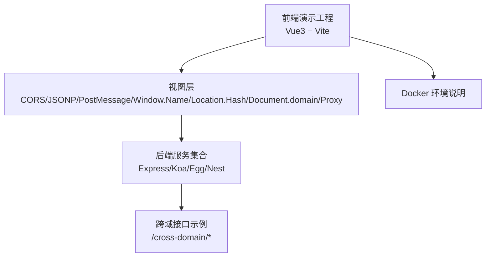
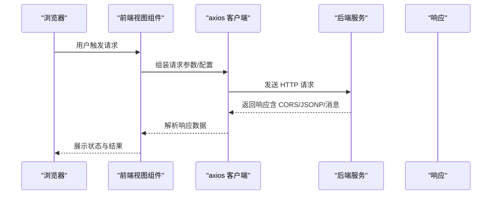
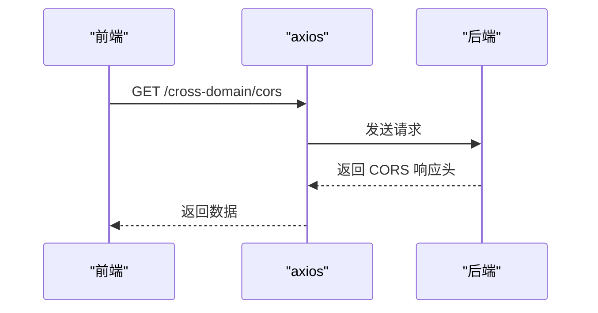
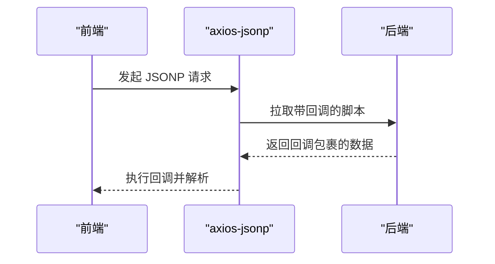
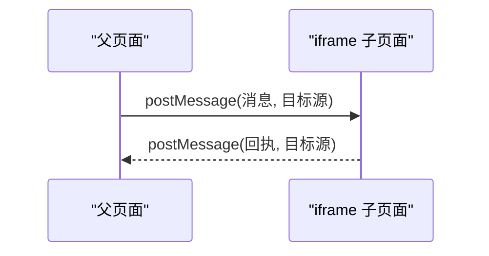
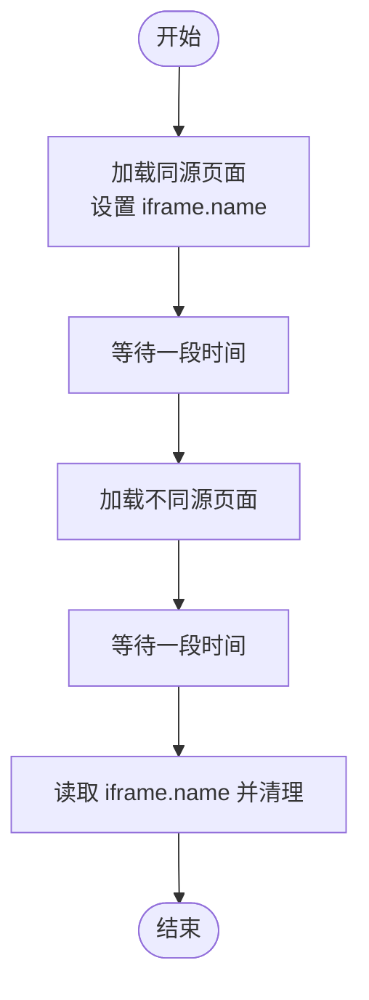
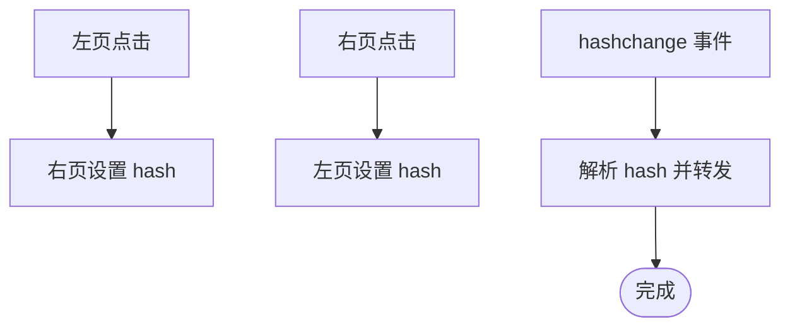
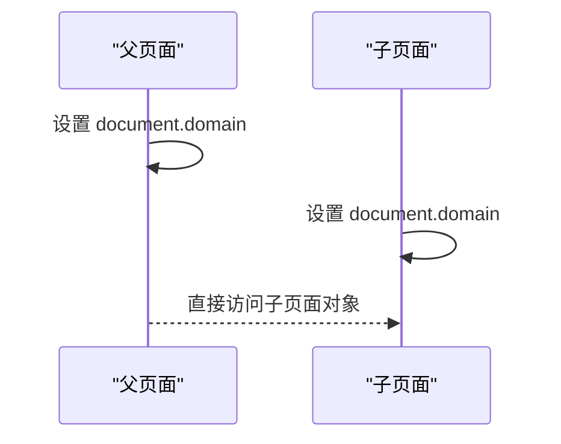
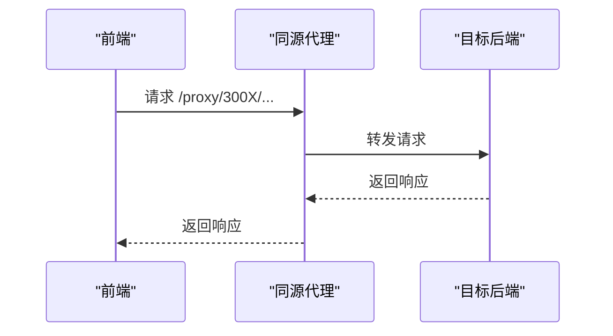
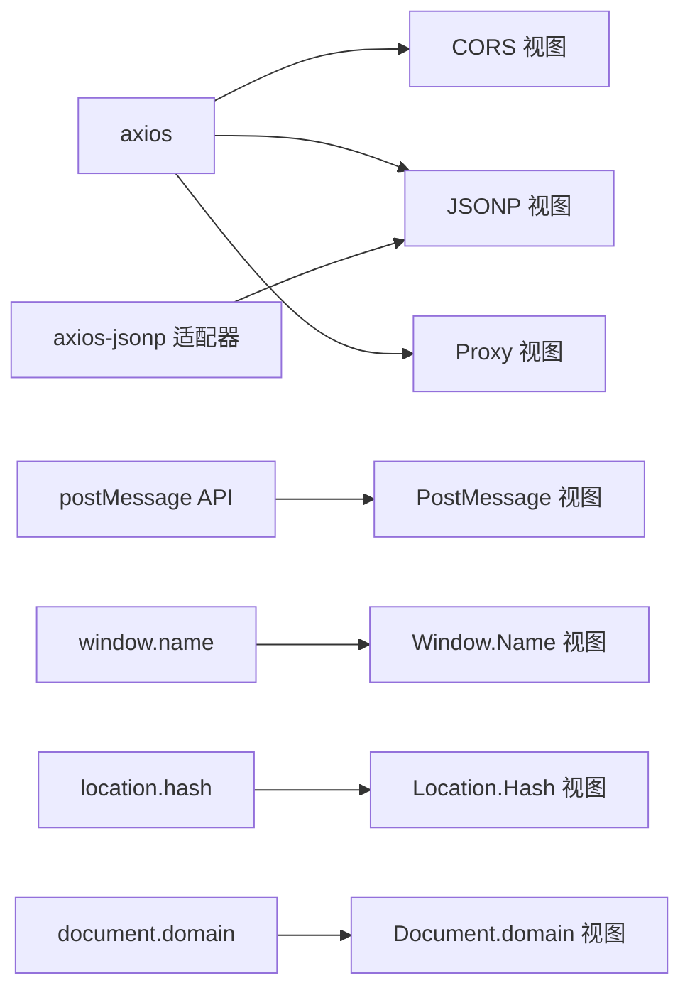

# 跨域处理系统

<cite>
**本文引用的文件**   
- [README.md](file://practice/vue3-frontend/cross-domain/README.md)
- [index-view.vue（CORS）](file://practice/vue3-frontend/cross-domain/src/views/cors/index-view.vue)
- [index-view.vue（JSONP）](file://practice/vue3-frontend/cross-domain/src/views/jsonp/index-view.vue)
- [index-view.vue（PostMessage）](file://practice/vue3-frontend/cross-domain/src/views/post-message/index-view.vue)
- [index-view.vue（Window.Name）](file://practice/vue3-frontend/cross-domain/src/views/window-name/index-view.vue)
- [index-view.vue（Location.Hash）](file://practice/vue3-frontend/cross-domain/src/views/location-hash/index-view.vue)
- [index-view.vue（Document.domain）](file://practice/vue3-frontend/cross-domain/src/views/document-domain/index-view.vue)
- [index-view.vue（Proxy）](file://practice/vue3-frontend/cross-domain/src/views/proxy/index-view.vue)
- [README.md（Docker 环境说明）](file://practice/docker-env/cross-domain/README.md)
</cite>

## 目录
1. [引言](#引言)
2. [项目结构](#项目结构)
3. [核心组件](#核心组件)
4. [架构总览](#架构总览)
5. [详细组件分析](#详细组件分析)
6. [依赖关系分析](#依赖关系分析)
7. [性能考量](#性能考量)
8. [故障排查指南](#故障排查指南)
9. [结论](#结论)
10. [附录](#附录)

## 引言
本技术文档围绕“跨域处理系统”展开，系统通过前端演示页面与多套后端服务（Express/Koa/Egg/Nest）配合，直观展示多种跨域解决方案：CORS、JSONP、PostMessage、Window.Name、Location.Hash、Document.domain 以及代理（Proxy）。文档从同源策略出发，解释跨域问题的成因，逐项阐述各方案的原理、实现要点、安全性、性能与兼容性，并提供可操作的调试建议与选型建议。

## 项目结构
该仓库包含一个 Vue3 前端演示工程与 Docker 化的跨域环境说明。前端工程提供多视图演示页面，分别对应不同的跨域方案；后端服务以 Express/Koa/Egg/Nest 多框架形式提供接口，用于验证 CORS、JSONP 等方案在服务端的响应行为。

图表来源
- [README.md:1-15](file://practice/vue3-frontend/cross-domain/README.md#L1-L15)
- [README.md（Docker 环境说明）:1-18](file://practice/docker-env/cross-domain/README.md#L1-L18)

章节来源
- [README.md:1-15](file://practice/vue3-frontend/cross-domain/README.md#L1-L15)
- [README.md（Docker 环境说明）:1-18](file://practice/docker-env/cross-domain/README.md#L1-L18)

## 核心组件
- 视图组件：每个跨域方案对应一个独立的 Vue 页面，负责发起请求或建立通信通道，并展示结果状态。
- 请求封装：统一使用 axios 发起请求，部分方案通过适配器或参数调整实现特定协议（如 JSONP）。
- 服务列表：前端维护一组后端服务地址，便于切换验证不同后端实现。
- 状态管理：通过响应式状态展示请求成功/失败/加载中，辅助用户理解各方案表现。

章节来源
- [index-view.vue（CORS）:1-90](file://practice/vue3-frontend/cross-domain/src/views/cors/index-view.vue#L1-L90)
- [index-view.vue（JSONP）:1-94](file://practice/vue3-frontend/cross-domain/src/views/jsonp/index-view.vue#L1-L94)
- [index-view.vue（PostMessage）:1-108](file://practice/vue3-frontend/cross-domain/src/views/post-message/index-view.vue#L1-L108)
- [index-view.vue（Window.Name）:1-214](file://practice/vue3-frontend/cross-domain/src/views/window-name/index-view.vue#L1-L214)
- [index-view.vue（Location.Hash）:1-96](file://practice/vue3-frontend/cross-domain/src/views/location-hash/index-view.vue#L1-L96)
- [index-view.vue（Document.domain）:1-123](file://practice/vue3-frontend/cross-domain/src/views/document-domain/index-view.vue#L1-L123)
- [index-view.vue（Proxy）:1-92](file://practice/vue3-frontend/cross-domain/src/views/proxy/index-view.vue#L1-L92)

## 架构总览
前端通过浏览器向不同后端服务发起请求，后端根据所选方案返回相应响应头或数据格式。对于需要跨域的场景，前端需正确配置请求参数或通信机制，后端则需设置允许跨域的响应头或采用特定协议。

图表来源
- [index-view.vue（CORS）:29-51](file://practice/vue3-frontend/cross-domain/src/views/cors/index-view.vue#L29-L51)
- [index-view.vue（JSONP）:30-36](file://practice/vue3-frontend/cross-domain/src/views/jsonp/index-view.vue#L30-L36)
- [index-view.vue（PostMessage）:25-69](file://practice/vue3-frontend/cross-domain/src/views/post-message/index-view.vue#L25-L69)
- [index-view.vue（Window.Name）:83-160](file://practice/vue3-frontend/cross-domain/src/views/window-name/index-view.vue#L83-L160)
- [index-view.vue（Location.Hash）:20-49](file://practice/vue3-frontend/cross-domain/src/views/location-hash/index-view.vue#L20-L49)
- [index-view.vue（Document.domain）:25-75](file://practice/vue3-frontend/cross-domain/src/views/document-domain/index-view.vue#L25-L75)
- [index-view.vue（Proxy）:29-53](file://practice/vue3-frontend/cross-domain/src/views/proxy/index-view.vue#L29-L53)

## 详细组件分析

### 同源策略与跨域问题概述
- 同源定义：协议、域名、端口三者均相同视为同源。
- 跨域限制：浏览器出于安全考虑，阻止脚本读取不同源的响应内容，除非服务端明确允许或采用特定通信机制。
- 常见场景：前端域名与后端域名不一致、端口不同、协议不同，导致跨域。

### CORS（跨域资源共享）
- 原理：通过在服务端设置响应头（如 Access-Control-Allow-Origin），允许指定来源访问资源；复杂请求会先发送预检请求（OPTIONS）。
- 实现要点：
  - 前端：直接使用 axios 发起请求，无需额外适配器。
  - 后端：设置允许来源、方法、头信息、凭据等响应头。
- 适用场景：现代浏览器支持良好，适合通用的跨域 API 访问。
- 安全性：可通过精确控制 Allow-Origin 与 Allow-Credentials，避免宽泛放行。
- 性能：简单请求无额外开销；复杂请求增加一次预检往返。
- 兼容性：IE10+ 支持，移动端普遍支持。

图表来源
- [index-view.vue（CORS）:43-51](file://practice/vue3-frontend/cross-domain/src/views/cors/index-view.vue#L43-L51)

章节来源
- [index-view.vue（CORS）:1-90](file://practice/vue3-frontend/cross-domain/src/views/cors/index-view.vue#L1-L90)

### JSONP（基于 script 标签的回调）
- 原理：利用 script 标签不受同源限制的特点，通过查询参数传递回调函数名，服务端返回以回调包裹的数据。
- 实现要点：
  - 前端：使用 axios-jsonp 适配器或手动拼接 script 标签。
  - 后端：按约定返回回调包裹的数据。
- 适用场景：仅支持 GET 请求，适合简单数据获取。
- 安全性：易受 XSS 影响，需严格校验回调名与来源。
- 性能：无需额外握手，首包延迟低。
- 兼容性：所有浏览器均支持。

图表来源
- [index-view.vue（JSONP）:30-36](file://practice/vue3-frontend/cross-domain/src/views/jsonp/index-view.vue#L30-L36)

章节来源
- [index-view.vue（JSONP）:1-94](file://practice/vue3-frontend/cross-domain/src/views/jsonp/index-view.vue#L1-L94)

### PostMessage（窗口消息通信）
- 原理：通过 postMessage 在父子窗口间传递消息，双方约定消息结构与目标源，实现跨域通信。
- 实现要点：
  - 前端：监听 message 事件，向子窗口发送消息时指定目标源。
  - 后端：不直接参与，但子页面可向其发起请求。
- 适用场景：父页面与 iframe 或弹窗之间的跨域交互。
- 安全性：必须校验 source 与 origin，避免任意来源注入。
- 性能：零额外网络开销，仅消息传递。
- 兼容性：IE8+ 支持。

图表来源
- [index-view.vue（PostMessage）:25-69](file://practice/vue3-frontend/cross-domain/src/views/post-message/index-view.vue#L25-L69)

章节来源
- [index-view.vue（PostMessage）:1-108](file://practice/vue3-frontend/cross-domain/src/views/post-message/index-view.vue#L1-L108)

### Window.Name（通过 iframe.name 传递数据）
- 原理：在同源阶段将数据写入 iframe 的 name 属性，再在不同源阶段读取该属性完成数据传递。
- 实现要点：
  - 前端：分阶段加载不同源 iframe，设置/读取 name。
  - 后端：不直接参与，但需要不同源页面存在。
- 适用场景：需要在不同源之间传递少量数据。
- 安全性：需确保 name 内容可信，防止注入。
- 性能：依赖 iframe 生命周期，存在加载等待。
- 兼容性：IE6+ 支持。

图表来源
- [index-view.vue（Window.Name）:83-160](file://practice/vue3-frontend/cross-domain/src/views/window-name/index-view.vue#L83-L160)

章节来源
- [index-view.vue（Window.Name）:1-214](file://practice/vue3-frontend/cross-domain/src/views/window-name/index-view.vue#L1-L214)

### Location.Hash（通过 hash 变更传递数据）
- 原理：在不同源页面间通过修改 hash 触发 hashchange 事件，实现数据传递。
- 实现要点：
  - 前端：监听 hashchange，解析并转发到对端 iframe。
  - 后端：不直接参与，但需要两个不同源页面。
- 适用场景：轻量数据传递与简单交互。
- 安全性：需校验来源与数据格式。
- 性能：零网络请求，仅 DOM 事件。
- 兼容性：所有浏览器支持。

图表来源
- [index-view.vue（Location.Hash）:20-49](file://practice/vue3-frontend/cross-domain/src/views/location-hash/index-view.vue#L20-L49)

章节来源
- [index-view.vue（Location.Hash）:1-96](file://practice/vue3-frontend/cross-domain/src/views/location-hash/index-view.vue#L1-L96)

### Document.domain（二级域名共享）
- 原理：当主域名相同时（如 a.example.com 与 b.example.com），通过设置 document.domain 使两者在 JS 层视为同源。
- 实现要点：
  - 前端：在父子页面均设置相同的主域。
  - 后端：不直接参与，但需要不同子域页面。
- 适用场景：同一主域下的子域通信。
- 安全性：仅限于主域相同的情况，避免误设。
- 性能：零网络请求，直接 DOM 访问。
- 兼容性：IE、Firefox 等较老内核支持。

图表来源
- [index-view.vue（Document.domain）:25-75](file://practice/vue3-frontend/cross-domain/src/views/document-domain/index-view.vue#L25-L75)

章节来源
- [index-view.vue（Document.domain）:1-123](file://practice/vue3-frontend/cross-domain/src/views/document-domain/index-view.vue#L1-L123)

### 代理（Proxy）
- 原理：前端请求指向同源代理路径，由代理服务器转发至目标后端，从而规避浏览器同源限制。
- 实现要点：
  - 前端：将请求前缀替换为同源代理路径。
  - 后端：代理服务器负责转发并处理跨域头。
- 适用场景：复杂请求或需要统一鉴权/日志的场景。
- 安全性：代理层可统一做鉴权与审计。
- 性能：增加一次代理往返，需关注代理服务器性能。
- 兼容性：所有浏览器支持。

图表来源
- [index-view.vue（Proxy）:43-53](file://practice/vue3-frontend/cross-domain/src/views/proxy/index-view.vue#L43-L53)

章节来源
- [index-view.vue（Proxy）:1-92](file://practice/vue3-frontend/cross-domain/src/views/proxy/index-view.vue#L1-L92)

## 依赖关系分析
- 前端依赖 axios 进行 HTTP 请求，部分方案引入 axios-jsonp 适配器以支持 JSONP。
- 各视图组件通过统一的状态与 UI 展示，串联起不同跨域方案的调用流程。
- 后端服务通过 Docker 环境启动，前端通过本地开发服务器访问不同端口的服务，模拟跨域场景。

图表来源
- [index-view.vue（CORS）:3-32](file://practice/vue3-frontend/cross-domain/src/views/cors/index-view.vue#L3-L32)
- [index-view.vue（JSONP）:4-36](file://practice/vue3-frontend/cross-domain/src/views/jsonp/index-view.vue#L4-L36)
- [index-view.vue（PostMessage）:1-74](file://practice/vue3-frontend/cross-domain/src/views/post-message/index-view.vue#L1-L74)
- [index-view.vue（Window.Name）:1-161](file://practice/vue3-frontend/cross-domain/src/views/window-name/index-view.vue#L1-L161)
- [index-view.vue（Location.Hash）:1-54](file://practice/vue3-frontend/cross-domain/src/views/location-hash/index-view.vue#L1-L54)
- [index-view.vue（Document.domain）:1-80](file://practice/vue3-frontend/cross-domain/src/views/document-domain/index-view.vue#L1-L80)
- [index-view.vue（Proxy）:3-32](file://practice/vue3-frontend/cross-domain/src/views/proxy/index-view.vue#L3-L32)

## 性能考量
- CORS：简单请求无额外开销；复杂请求增加一次预检往返，建议尽量复用简单请求或减少复杂请求次数。
- JSONP：无需额外握手，但仅 GET 请求，且存在安全风险，需谨慎使用。
- PostMessage：零网络开销，适合频繁小消息传递。
- Window.Name：依赖 iframe 生命周期，存在加载等待时间。
- Location.Hash：零网络开销，但对数据长度有限制，适合轻量数据。
- Document.domain：零网络开销，但仅适用于主域相同场景。
- 代理：增加一次代理往返，建议在高并发场景下优化代理服务器性能与缓存策略。

## 故障排查指南
- CORS 预检失败：检查后端是否正确设置允许的方法、头信息与来源，确认是否携带凭据。
- JSONP 回调失败：确认回调函数名与服务端约定一致，避免跨站脚本注入。
- PostMessage 未收到消息：检查目标源与消息结构，确保双方约定一致并校验来源。
- Window.Name 数据丢失：确认在不同源阶段正确设置与读取 name，并注意清理。
- Location.Hash 未触发：检查 hashchange 事件绑定与 hash 值格式。
- Document.domain 不生效：确认两端均设置了相同的主域，且页面已加载完成。
- 代理请求异常：检查代理路径映射与后端转发逻辑，确认代理服务器可达。

## 结论
- 对于现代浏览器与通用 API 场景，优先采用 CORS；对仅 GET 的简单数据获取可考虑 JSONP。
- 父子窗口跨域交互首选 PostMessage；需要在不同源页面间传递少量数据可用 Window.Name 或 Location.Hash。
- 当主域相同时，可使用 Document.domain 简化通信。
- 对于复杂请求或统一鉴权需求，推荐使用代理方案。
- 无论采用哪种方案，都应重视安全与性能，结合业务场景进行选型与优化。

## 附录
- 快速启动前端演示工程与 Docker 环境，参考以下命令与说明：
  - 前端安装与运行：参见前端工程根目录说明。
  - Docker 环境启动与停止：参见 Docker 环境说明文档。

章节来源
- [README.md:1-15](file://practice/vue3-frontend/cross-domain/README.md#L1-L15)
- [README.md（Docker 环境说明）:1-18](file://practice/docker-env/cross-domain/README.md#L1-L18)