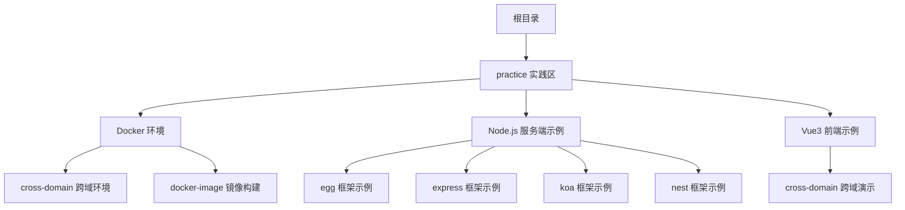
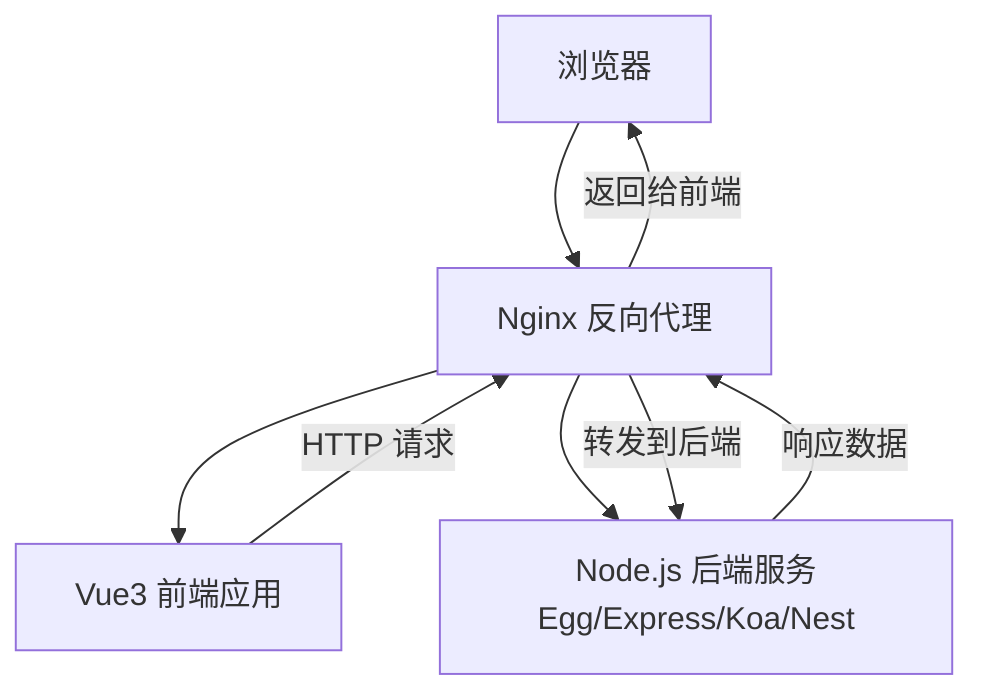
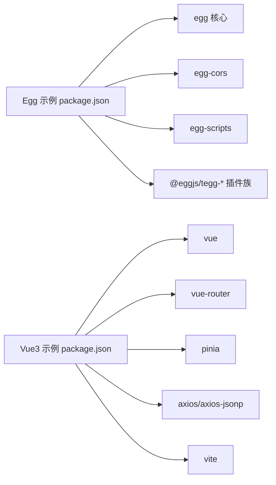

# 学习路径

<cite>
**本文引用的文件**
- [README.md](file://README.md)
- [README.zh-CN.md](file://README.zh-CN.md)
- [practice/README.md](file://practice/README.md)
- [practice/README.zh-CN.md](file://practice/README.zh-CN.md)
- [practice/nodejs-service/egg/cross-domain/package.json](file://practice/nodejs-service/egg/cross-domain/package.json)
- [practice/vue3-frontend/cross-domain/package.json](file://practice/vue3-frontend/cross-domain/package.json)
</cite>

## 目录
1. [引言](#引言)
2. [项目结构](#项目结构)
3. [核心组件](#核心组件)
4. [架构总览](#架构总览)
5. [详细组件分析](#详细组件分析)
6. [依赖分析](#依赖分析)
7. [性能考虑](#性能考虑)
8. [故障排查指南](#故障排查指南)
9. [结论](#结论)
10. [附录](#附录)

## 引言
本学习路径面向不同技术背景的开发者，围绕 Collection-Space 仓库中的“实践”模块，提供从入门到进阶的系统化学习计划。该仓库以“后端多框架示例 + 前端跨域演示 + Docker 环境准备”为核心，覆盖后端框架（Egg/Express/Koa/Nest）、前端（Vue3）以及跨域与容器化等企业级主题。学习者可依据自身水平选择合适起点，并按阶段递进：先理解工程结构与运行方式，再深入各框架特性与最佳实践，最后完成综合项目实战。

## 项目结构
仓库采用“按主题分层”的组织方式，核心实践区域位于 practice 目录，包含：
- Docker 环境准备：cross-domain（跨域演示环境）、docker-image（基于 dockerfile 构建镜像）
- Node.js 服务端示例：egg、express、koa、nest 等多框架示例
- Vue3 前端：跨域演示与常用生态集成

下图给出与学习路径直接相关的目录关系概览：

图表来源
- [practice/README.md:1-26](file://practice/README.md#L1-L26)
- [practice/README.zh-CN.md:1-34](file://practice/README.zh-CN.md#L1-L34)

章节来源
- [README.md:1-18](file://README.md#L1-L18)
- [README.zh-CN.md:1-18](file://README.zh-CN.md#L1-L18)
- [practice/README.md:1-26](file://practice/README.md#L1-L26)
- [practice/README.zh-CN.md:1-34](file://practice/README.zh-CN.md#L1-L34)

## 核心组件
- 后端框架示例（Node.js）
  - Egg：提供 TypeScript 支持、模块化与插件体系，适合中大型企业应用。
  - Express/Koa/Nest：轻量到强框架化，便于对比学习中间件、路由与依赖注入等差异。
- 前端示例（Vue3）
  - Vite + Vue3 + TypeScript + 路由/状态管理组合，覆盖现代前端开发栈。
- 跨域与容器化
  - Docker Compose 编排 + Nginx 反向代理 + 前后端联调，模拟真实部署场景。
  - 跨域演示涵盖 CORS、JSONP、postMessage、window.name、location.hash 等方案。

章节来源
- [practice/README.md:12-22](file://practice/README.md#L12-L22)
- [practice/README.zh-CN.md:20-34](file://practice/README.zh-CN.md#L20-L34)
- [practice/nodejs-service/egg/cross-domain/package.json:1-58](file://practice/nodejs-service/egg/cross-domain/package.json#L1-L58)
- [practice/vue3-frontend/cross-domain/package.json:1-43](file://practice/vue3-frontend/cross-domain/package.json#L1-L43)

## 架构总览
下图展示“前端（Vue3）—反向代理（Nginx）—后端（多框架）”的整体交互流程，体现跨域与容器化联调的关键节点。

图表来源
- [practice/README.md:3-11](file://practice/README.md#L3-L11)
- [practice/README.zh-CN.md:3-11](file://practice/README.zh-CN.md#L3-L11)

## 详细组件分析

### 初学者学习路径（30 天）
目标：理解工程结构、运行与调试流程，掌握跨域与容器化基础，完成最小可用项目。

- 第1周：环境与工具
  - 安装 Node.js（版本要求见后端包配置）、pnpm、Docker、Docker Compose、Git。
  - 运行任意一个后端示例（如 Egg），观察启动脚本与日志输出。
  - 运行 Vue3 前端示例，理解 Vite 开发服务器与热更新机制。
  - 使用 Docker 环境准备脚本，拉起跨域演示环境并验证 Nginx 配置。
  - 关键产出：能独立启动前后端、查看日志、修改入口文件并观察效果。

- 第2周：跨域与中间件
  - 在 Egg 示例中添加简单中间件（如请求 ID 注入、日志记录），理解中间件链路。
  - 对比 Express/Koa 的中间件风格差异，总结适用场景。
  - 在 Vue3 中发起跨域请求，结合 Nginx 反向代理与后端 CORS 配置，验证不同跨域方案。
  - 关键产出：能编写基础中间件、理解跨域原理与配置要点。

- 第3周：容器化与部署
  - 阅读并运行 dockerfile，理解镜像构建步骤与运行参数。
  - 使用 docker-compose 编排前端、后端与 Nginx，完成本地联调。
  - 关键产出：能独立构建镜像、编排服务、暴露端口并进行连通性测试。

- 第4周：小项目实战
  - 组合任一后端框架与 Vue3 前端，实现一个“用户列表/详情”页面，支持跨域访问与本地联调。
  - 完成 CI/CD 流程（参考 ci&cd 目录脚本思路），至少包含“格式化、静态检查、类型检查、构建”等步骤。
  - 关键产出：具备从零到一交付一个可运行项目的完整能力。

章节来源
- [practice/nodejs-service/egg/cross-domain/package.json:9-22](file://practice/nodejs-service/egg/cross-domain/package.json#L9-L22)
- [practice/vue3-frontend/cross-domain/package.json:6-15](file://practice/vue3-frontend/cross-domain/package.json#L6-L15)
- [practice/README.md:3-11](file://practice/README.md#L3-L11)

### 中级开发者学习路径（45 天）
目标：深入理解各后端框架特性、中间件与插件机制，掌握多进程与监控，完成企业级功能实现。

- 第1周：后端框架对比与中间件
  - 分别在 Egg、Express、Koa、Nest 中实现相同业务接口，对比路由、中间件、依赖注入与生命周期。
  - 在 Egg 中启用 CORS 插件与自定义中间件，理解插件加载顺序与作用域。
  - 在 Nest 中引入模块化与拦截器/管道/守卫，体验强框架的约定式结构。
  - 关键产出：能根据场景选择合适框架，并熟练扩展中间件与插件。

- 第2周：多进程与稳定性
  - 在 Express/Koa 中实现集群模式与 PM2 部署，理解进程模型与负载均衡。
  - 在 Egg 中使用 egg-scripts 管理生产态进程，关注守护进程、日志与健康检查。
  - 关键产出：具备多进程部署与进程监控的基础能力。

- 第3周：可观测性与日志
  - 在各框架中接入日志中间件（Morgan/log4js/console），统一请求链路追踪。
  - 结合请求 ID 中间件，串联前端、Nginx、后端的日志，定位问题。
  - 关键产出：具备完整的日志采集与链路追踪能力。

- 第4周：模板与工程化
  - 在 Egg/Express/Koa/Nest 中分别创建“模板项目”，包含目录规范、TypeScript 配置、ESLint/Prettier、Dockerfile、CI 脚本等。
  - 将模板项目标准化为可复用的脚手架或子模块。
  - 关键产出：形成可复用的工程化模板与规范。

- 第5周：企业级功能实现
  - 实现鉴权（Token/Session）、限流、缓存、异步任务队列等常见企业功能。
  - 在前端通过 Axios/拦截器统一处理错误码与重试策略。
  - 关键产出：具备实现典型企业功能的能力。

章节来源
- [practice/nodejs-service/egg/cross-domain/package.json:23-47](file://practice/nodejs-service/egg/cross-domain/package.json#L23-L47)
- [practice/README.md:12-22](file://practice/README.md#L12-L22)
- [practice/README.zh-CN.md:20-34](file://practice/README.zh-CN.md#L20-L34)

### 高级开发者学习路径（60 天）
目标：掌握高并发、高可用与可观测性设计，完成复杂场景的工程化落地。

- 第1周：高可用与弹性
  - 设计多实例部署与自动扩缩容策略，结合 Nginx/PM2/容器编排实现故障隔离与快速恢复。
  - 引入健康检查端点与熔断降级策略，保障系统稳定性。
  - 关键产出：具备高可用架构设计与落地能力。

- 第2周：性能优化与压测
  - 对比不同框架的启动时间、内存占用与吞吐表现，定位瓶颈。
  - 使用压测工具对关键接口进行压力测试，识别数据库/网络/缓存瓶颈。
  - 关键产出：具备性能分析与优化能力。

- 第3周：可观测性与告警
  - 集成 APM/Trace/指标采集，统一收集日志、链路与指标。
  - 建立告警规则与应急预案，实现自动化运维闭环。
  - 关键产出：具备完整的可观测性体系与应急响应能力。

- 第4周：安全加固与合规
  - 实施输入校验、SQL 注入防护、XSS/CSRF 防护、敏感信息脱敏等安全措施。
  - 遵循合规要求（如数据留存、审计日志），完善安全基线。
  - 关键产出：具备安全设计与合规落地能力。

- 第5周：复杂场景实战
  - 实战案例：实时消息推送、分布式锁、幂等性控制、分布式事务等。
  - 在前端实现长连接/轮询/事件流等不同数据同步策略。
  - 关键产出：具备解决复杂业务问题的工程化能力。

章节来源
- [practice/README.md:1-26](file://practice/README.md#L1-L26)
- [practice/README.zh-CN.md:1-34](file://practice/README.zh-CN.md#L1-L34)

## 依赖分析
- 后端框架依赖
  - Egg：包含 TypeScript、TeGG 插件生态、CORS、脚本管理与追踪等依赖，适合企业级工程化。
  - Express/Koa/Nest：均提供中间件生态与路由能力，可按需裁剪。
- 前端依赖
  - Vue3 + Vite + TypeScript + 路由/状态管理 + Axios 生态，满足现代前端开发需求。
- 工具链
  - ESLint/Prettier/TypeScript/Vue-TSC 等保证代码质量与类型安全。
  - Dockerfile 与 docker-compose 提供一致的运行环境。

图表来源
- [practice/nodejs-service/egg/cross-domain/package.json:23-47](file://practice/nodejs-service/egg/cross-domain/package.json#L23-L47)
- [practice/vue3-frontend/cross-domain/package.json:16-41](file://practice/vue3-frontend/cross-domain/package.json#L16-L41)

章节来源
- [practice/nodejs-service/egg/cross-domain/package.json:1-58](file://practice/nodejs-service/egg/cross-domain/package.json#L1-L58)
- [practice/vue3-frontend/cross-domain/package.json:1-43](file://practice/vue3-frontend/cross-domain/package.json#L1-L43)

## 性能考虑
- 启动与冷启动
  - 优先使用 TypeScript 编译产物与预构建工具（Vite/TS 编译缓存）缩短启动时间。
- 内存与并发
  - 在多进程模式下合理设置 worker 数量，避免单实例内存溢出；结合容器资源限制与健康检查。
- 网络与 IO
  - 合理配置 Nginx 反向代理超时与缓冲区，减少后端压力；对静态资源走 CDN 或本地缓存。
- 监控与诊断
  - 通过统一日志与链路追踪定位慢请求与异常；建立指标看板与告警阈值。

## 故障排查指南
- 启动失败
  - 检查 Node.js 版本是否满足引擎要求；确认端口未被占用；查看日志输出定位错误。
- 跨域问题
  - 核对后端 CORS 配置与前端请求头；确认 Nginx 反代是否透传必要头部。
- 容器化问题
  - 确认 docker-compose 服务依赖顺序与网络互通；检查镜像构建日志与容器健康状态。
- 日志与追踪
  - 在中间件中注入请求 ID，串联前端、Nginx、后端日志，快速定位问题根因。

## 结论
通过本学习路径，初学者可快速上手工程结构与运行方式，中级开发者可深入掌握多框架特性与企业级功能，高级开发者则能在高可用、性能与可观测性方面完成系统化落地。建议以“实践驱动 + 问题导向”的方式推进，边学边做，逐步形成自己的工程化模板与最佳实践。

## 附录
- 实践项目选择建议
  - 初学者：从 Egg 的 cross-domain 示例入手，同时运行 Vue3 前端，完成一次跨域联调。
  - 中级开发者：对比 Express/Koa/Nest 的中间件与模块化差异，完成多进程与日志链路搭建。
  - 高级开发者：实现鉴权、限流、缓存、压测与可观测性，形成可复用的企业级模板。
- 完成标准
  - 能独立运行所有示例并解释其原理；
  - 能针对特定场景选择合适框架与方案；
  - 能输出可复用的工程化模板与 CI/CD 流程；
  - 能完成跨域、容器化、多进程、日志与监控等企业级能力的集成与验证。