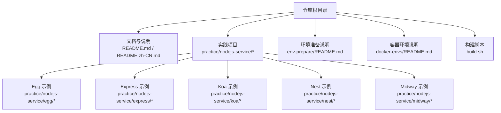
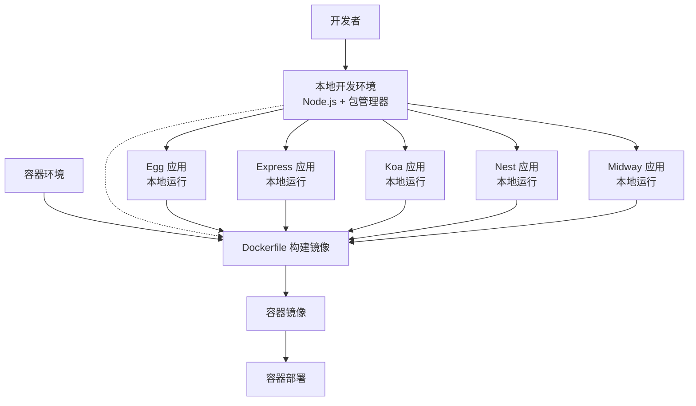
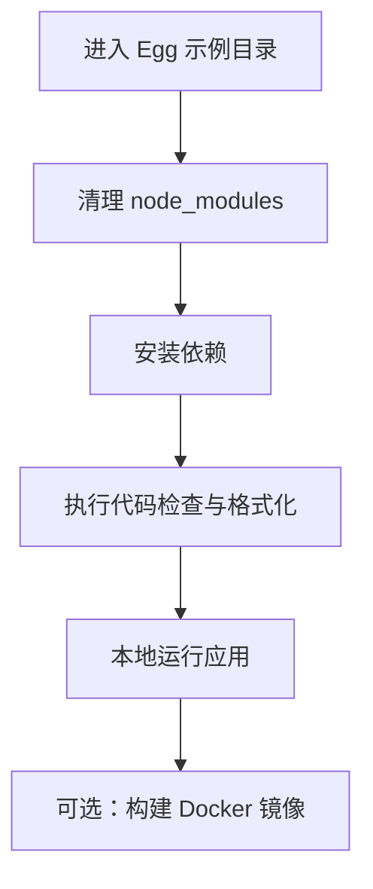
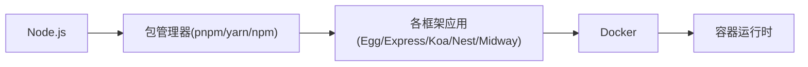

# 快速开始

<cite>
**本文引用的文件**
- [README.md](file://README.md)
- [README.zh-CN.md](file://README.zh-CN.md)
- [env-prepare/README.md](file://env-prepare/README.md)
- [docker-envs/README.md](file://docker-envs/README.md)
- [build.sh](file://build.sh)
- [practice/nodejs-service/egg/run.sh](file://practice/nodejs-service/egg/run.sh)
</cite>

## 目录
1. [简介](#简介)
2. [项目结构](#项目结构)
3. [核心组件](#核心组件)
4. [架构总览](#架构总览)
5. [详细组件分析](#详细组件分析)
6. [依赖关系分析](#依赖关系分析)
7. [性能考虑](#性能考虑)
8. [故障排除指南](#故障排除指南)
9. [结论](#结论)
10. [附录](#附录)

## 简介
本指南面向希望快速上手 Collection-Space 项目的用户，提供从环境准备到服务启动的完整路径，并覆盖多平台与多框架（Egg、Express、Koa、Nest、Midway）的启动方式。同时给出常见问题排查建议与不同技术背景用户的入门路径。

## 项目结构
仓库采用“路径规划”组织方式，核心实践代码集中在 practice/nodejs-service 下，包含多个 Node.js 框架示例与容器化模板；另有独立的环境准备与容器环境说明文档已迁移至其他仓库。

图表来源
- [README.md:1-18](file://README.md#L1-L18)
- [README.zh-CN.md:1-18](file://README.zh-CN.md#L1-L18)
- [env-prepare/README.md:1-6](file://env-prepare/README.md#L1-L6)
- [docker-envs/README.md:1-6](file://docker-envs/README.md#L1-L6)

章节来源
- [README.md:1-18](file://README.md#L1-L18)
- [README.zh-CN.md:1-18](file://README.zh-CN.md#L1-L18)

## 核心组件
- 环境准备与容器环境：相关脚本与说明已迁移至独立仓库，可参考对应链接获取最新版本。
- Node.js 实践服务：Egg、Express、Koa、Nest、Midway 多框架示例，均提供本地运行与容器镜像构建模板。
- 构建脚本：顶层 build.sh 可用于合并与构建环境准备脚本。

章节来源
- [env-prepare/README.md:1-6](file://env-prepare/README.md#L1-L6)
- [docker-envs/README.md:1-6](file://docker-envs/README.md#L1-L6)
- [build.sh:1-5](file://build.sh#L1-L5)

## 架构总览
下图展示从本地开发到容器化部署的典型路径，以及各组件之间的关系。

## 详细组件分析

### Egg 示例（本地与容器）
- 本地启动要点
  - 进入示例子目录后，清理旧依赖并重新安装，随后执行代码检查与格式化任务。
  - 使用顶层 run.sh 可批量对所有子模块执行安装、校验与格式化流程。
- 容器化要点
  - 示例提供 dockerfile 与 docker-image 子目录，可基于模板进行镜像构建与运行。

图表来源
- [practice/nodejs-service/egg/run.sh:1-22](file://practice/nodejs-service/egg/run.sh#L1-L22)

章节来源
- [practice/nodejs-service/egg/run.sh:1-22](file://practice/nodejs-service/egg/run.sh#L1-L22)

### Express/Koa/Nest/Midway 示例（本地与容器）
- 本地启动要点
  - 各框架示例均提供 run.sh 或类似脚本，便于一键安装、校验与运行。
  - 建议先在本地完成依赖安装与基础校验，再进行容器化。
- 容器化要点
  - 各框架均提供 dockerfile 与 docker-image 模板，按需选择使用。

章节来源
- [README.md:15-15](file://README.md#L15-L15)
- [README.zh-CN.md:15-15](file://README.zh-CN.md#L15-L15)

## 依赖关系分析
- 组件耦合
  - 各框架示例相互独立，彼此无直接依赖；通过统一的包管理器与构建工具链协同工作。
- 外部依赖
  - Node.js 版本与包管理器（如 pnpm）是本地运行的基础。
  - Docker 是容器化部署的关键工具。
- 迁移与集成
  - 环境准备与容器环境相关脚本已迁移至独立仓库，建议在新环境中优先拉取对应仓库以获得稳定支持。

## 性能考虑
- 本地开发
  - 使用增量安装与缓存策略减少重复安装时间。
  - 在 CI 中复用依赖缓存，缩短流水线时长。
- 容器化
  - 合理分层 Dockerfile，利用镜像缓存加速构建。
  - 控制镜像体积，避免不必要的依赖与日志文件进入镜像。

## 故障排除指南
- 依赖安装失败
  - 清理缓存并重试安装；确认网络与包源可用。
  - 若使用 pnpm，请检查锁定文件与 Node.js 版本兼容性。
- 权限问题
  - 在 Linux/macOS 上，确保脚本具备可执行权限；必要时使用 sudo 提升权限（谨慎使用）。
- 端口占用
  - 更换本地端口或停止占用进程后再试。
- 容器无法启动
  - 检查镜像构建是否成功、环境变量与挂载卷配置是否正确。
  - 查看容器日志定位错误原因。

## 结论
通过本快速开始指南，您可以在本地与容器环境中快速启动 Collection-Space 的 Node.js 实践项目。建议优先完成环境准备与依赖安装，再根据需要选择框架与部署方式。遇到问题时，可依据故障排除指南逐步定位与解决。

## 附录
- 入门路径建议
  - 初学者：先完成环境准备与本地运行，熟悉项目结构后再尝试容器化。
  - 进阶用户：直接使用容器镜像模板，结合 CI/CD 流水线实现自动化部署。
- 相关仓库
  - 环境准备与容器环境脚本已迁移至独立仓库，详见对应 README 链接。