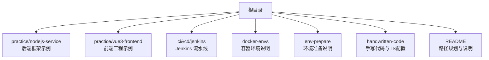
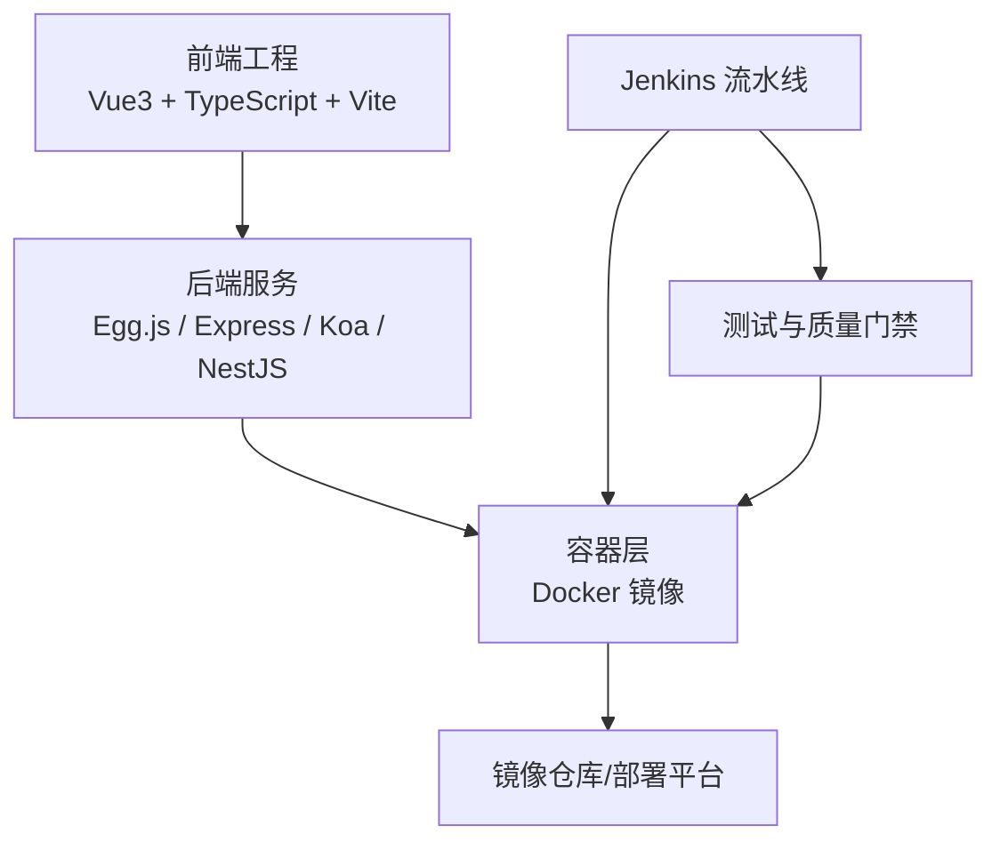
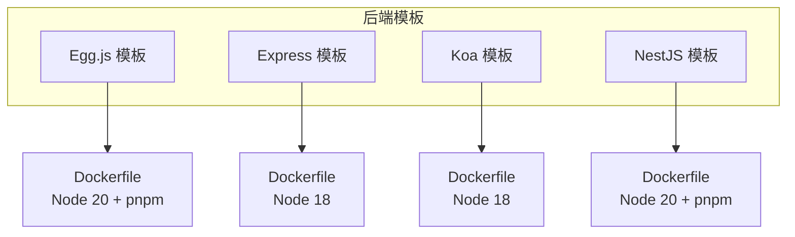
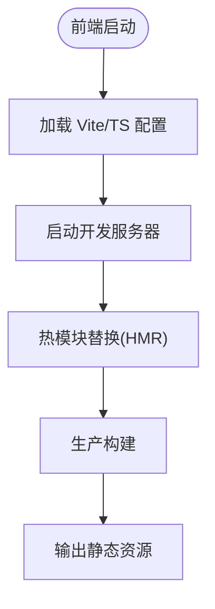
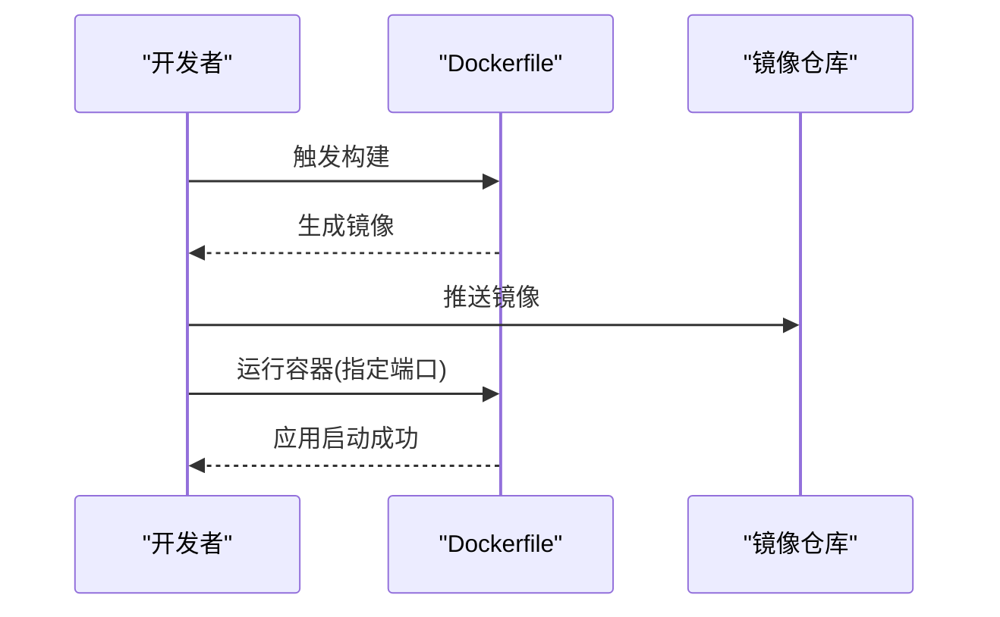
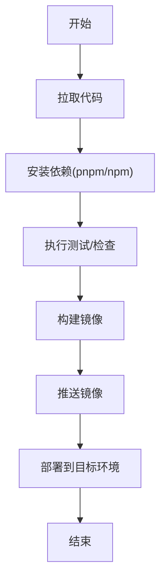
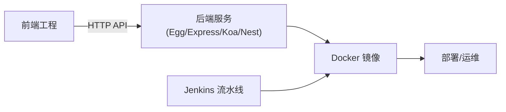

# 技术栈概览

<cite>
**本文引用的文件**
- [README.md](file://README.md)
- [egg/docker-image/dockerfile](file://practice/nodejs-service/egg/docker-image/dockerfile)
- [egg/docker-image/package.json](file://practice/nodejs-service/egg/docker-image/package.json)
- [express/docker-image/dockerfile](file://practice/nodejs-service/express/docker-image/dockerfile)
- [express/docker-image/package.json](file://practice/nodejs-service/express/docker-image/package.json)
- [koa/docker-image/dockerfile](file://practice/nodejs-service/koa/docker-image/dockerfile)
- [koa/docker-image/package.json](file://practice/nodejs-service/koa/docker-image/package.json)
- [nest/docker-image/dockerfile](file://practice/nodejs-service/nest/docker-image/dockerfile)
- [nest/docker-image/package.json](file://practice/nodejs-service/nest/docker-image/package.json)
- [vue3-frontend/vite.config.ts](file://practice/vue3-frontend/vite.config.ts)
- [vue3-frontend/package.json](file://practice/vue3-frontend/package.json)
- [vue3-frontend/tsconfig.json](file://practice/vue3-frontend/tsconfig.json)
- [handwritten-code/package.json](file://handwritten-code/package.json)
- [handwritten-code/tsconfig.json](file://handwritten-code/tsconfig.json)
- [jenkinsfile/README.md](file://ci&cd/jenkins/jenkinsfile/README.md)
- [docker-envs/README.md](file://docker-envs/README.md)
- [env-prepare/README.md](file://env-prepare/README.md)
</cite>

## 目录
1. [引言](#引言)
2. [项目结构](#项目结构)
3. [核心组件](#核心组件)
4. [架构总览](#架构总览)
5. [详细组件分析](#详细组件分析)
6. [依赖关系分析](#依赖关系分析)
7. [性能考虑](#性能考虑)
8. [故障排查指南](#故障排查指南)
9. [结论](#结论)
10. [附录](#附录)

## 引言
本文件为 Collection-Space 项目的“技术栈概览”，聚焦于后端（Egg.js、Express、Koa、NestJS）、前端（Vue3、TypeScript、Vite）、容器化（Docker）与 CI/CD（Jenkins）等核心技术选型与应用说明。文档既面向初学者解释关键概念，也为有经验的开发者提供版本要求、兼容性与实践建议。

## 项目结构
该项目采用按“实践模块”组织的多语言/多框架示例结构，便于对比不同后端框架与前端技术栈的差异与共性。核心目录如下：
- practice/nodejs-service：包含 Egg.js、Express、Koa、NestJS 的最小可运行模板与 Docker 化示例
- practice/vue3-frontend：Vue3 + TypeScript + Vite 前端工程示例
- ci&cd/jenkins：Jenkins 多阶段流水线脚本
- docker-envs、env-prepare：环境准备与容器编排说明
- handwritten-code：手写代码与 TypeScript 配置示例
- 根 README：仓库路径规划与外部 API 文档链接

章节来源
- [README.md:1-18](file://README.md#L1-L18)

## 核心组件
本节从后端、前端、容器化与 CI/CD 四个维度梳理技术栈与版本要求，并给出选择理由与应用场景。

- 后端技术栈
  - Egg.js：企业级 Node.js 框架，强调约定优于配置与插件生态；适合中大型服务与团队协作。
  - Express：轻量、灵活、上手快，适合小型服务或原型开发。
  - Koa：基于 ES6 Generator/Async 的新一代 Web 框架，中间件模型更简洁。
  - NestJS：基于 TypeScript 的企业级框架，提供模块化、依赖注入与 Angular 风格的架构。

- 前端技术栈
  - Vue3：渐进式框架，组合式 API 提升开发体验与性能。
  - TypeScript：静态类型系统，提升代码质量与可维护性。
  - Vite：快速构建工具与开发服务器，热更新与打包效率高。

- 容器化技术
  - Docker：统一环境、隔离依赖、简化部署；各后端模板均提供 dockerfile 与镜像构建脚本。

- CI/CD 工具
  - Jenkins：多分支/多服务流水线，支持并行构建、测试与发布。

章节来源
- [egg/docker-image/package.json:1-57](file://practice/nodejs-service/egg/docker-image/package.json#L1-L57)
- [express/docker-image/package.json:1-24](file://practice/nodejs-service/express/docker-image/package.json#L1-L24)
- [koa/docker-image/package.json:1-22](file://practice/nodejs-service/koa/docker-image/package.json#L1-L22)
- [nest/docker-image/package.json:1-69](file://practice/nodejs-service/nest/docker-image/package.json#L1-L69)
- [vue3-frontend/package.json:1-200](file://practice/vue3-frontend/package.json)
- [vue3-frontend/vite.config.ts:1-200](file://practice/vue3-frontend/vite.config.ts)
- [vue3-frontend/tsconfig.json:1-200](file://practice/vue3-frontend/tsconfig.json)
- [handwritten-code/package.json:1-200](file://handwritten-code/package.json)
- [handwritten-code/tsconfig.json:1-200](file://handwritten-code/tsconfig.json)

## 架构总览
下图展示了前端、后端与容器层的整体交互关系，以及 CI/CD 在其中的作用位置。

图表来源
- [egg/docker-image/dockerfile:1-26](file://practice/nodejs-service/egg/docker-image/dockerfile#L1-L26)
- [express/docker-image/dockerfile:1-20](file://practice/nodejs-service/express/docker-image/dockerfile#L1-L20)
- [koa/docker-image/dockerfile:1-20](file://practice/nodejs-service/koa/docker-image/dockerfile#L1-L20)
- [nest/docker-image/dockerfile:1-26](file://practice/nodejs-service/nest/docker-image/dockerfile#L1-L26)
- [jenkinsfile/README.md:1-200](file://ci&cd/jenkins/jenkinsfile/README.md)

## 详细组件分析

### 后端框架对比与选型建议
- Egg.js
  - 版本与特性：使用 TypeScript 支持与插件生态，适合需要稳定约定的企业服务。
  - 容器镜像：基于 Node 20 Alpine，使用 pnpm，生产模式通过 egg-scripts 启动。
  - 端口与脚本：默认监听 3002，提供开发、生产与容器启动脚本。
- Express
  - 版本与特性：经典 Web 框架，简单易用，适合小而美的服务。
  - 容器镜像：基于 Node 18 Alpine，直接 npm install 与启动。
- Koa
  - 版本与特性：中间件模型更现代，适合对性能与灵活性有更高要求的服务。
  - 容器镜像：基于 Node 18 Alpine，结构与 Express 类似。
- NestJS
  - 版本与特性：强类型、模块化、依赖注入，适合大型复杂业务。
  - 容器镜像：基于 Node 20 Alpine，使用 pnpm，构建后以 dist 运行。

图表来源
- [egg/docker-image/dockerfile:1-26](file://practice/nodejs-service/egg/docker-image/dockerfile#L1-L26)
- [express/docker-image/dockerfile:1-20](file://practice/nodejs-service/express/docker-image/dockerfile#L1-L20)
- [koa/docker-image/dockerfile:1-20](file://practice/nodejs-service/koa/docker-image/dockerfile#L1-L20)
- [nest/docker-image/dockerfile:1-26](file://practice/nodejs-service/nest/docker-image/dockerfile#L1-L26)

章节来源
- [egg/docker-image/package.json:1-57](file://practice/nodejs-service/egg/docker-image/package.json#L1-L57)
- [express/docker-image/package.json:1-24](file://practice/nodejs-service/express/docker-image/package.json#L1-L24)
- [koa/docker-image/package.json:1-22](file://practice/nodejs-service/koa/docker-image/package.json#L1-L22)
- [nest/docker-image/package.json:1-69](file://practice/nodejs-service/nest/docker-image/package.json#L1-L69)

### 前端技术栈（Vue3 + TypeScript + Vite）
- Vue3：组合式 API、更好的 Tree-shaking 与性能。
- TypeScript：提供类型安全与更好的 IDE 支持。
- Vite：快速冷启、热更新与现代化打包能力。
- 配置要点：vite.config.ts、tsconfig.json 与 package.json 中的脚本与依赖共同构成前端工程基础。

图表来源
- [vue3-frontend/vite.config.ts:1-200](file://practice/vue3-frontend/vite.config.ts)
- [vue3-frontend/tsconfig.json:1-200](file://practice/vue3-frontend/tsconfig.json)
- [vue3-frontend/package.json:1-200](file://practice/vue3-frontend/package.json)

章节来源
- [vue3-frontend/package.json:1-200](file://practice/vue3-frontend/package.json)
- [vue3-frontend/vite.config.ts:1-200](file://practice/vue3-frontend/vite.config.ts)
- [vue3-frontend/tsconfig.json:1-200](file://practice/vue3-frontend/tsconfig.json)

### 容器化（Docker）
- 统一基础镜像：Egg/Nest 使用 Node 20 Alpine，Express/Koa 使用 Node 18 Alpine。
- 依赖管理：Egg/Nest 使用 pnpm，Express/Koa 使用 npm。
- 构建流程：复制 package.json/pnpm-lock.yaml → 安装依赖 → 复制源码 → 构建/清理 dev 依赖 → 暴露端口 → 启动命令。
- 端口暴露：Egg/Nest 3002，Express 3000，Koa 3001。

图表来源
- [egg/docker-image/dockerfile:1-26](file://practice/nodejs-service/egg/docker-image/dockerfile#L1-L26)
- [express/docker-image/dockerfile:1-20](file://practice/nodejs-service/express/docker-image/dockerfile#L1-L20)
- [koa/docker-image/dockerfile:1-20](file://practice/nodejs-service/koa/docker-image/dockerfile#L1-L20)
- [nest/docker-image/dockerfile:1-26](file://practice/nodejs-service/nest/docker-image/dockerfile#L1-L26)

章节来源
- [egg/docker-image/dockerfile:1-26](file://practice/nodejs-service/egg/docker-image/dockerfile#L1-L26)
- [express/docker-image/dockerfile:1-20](file://practice/nodejs-service/express/docker-image/dockerfile#L1-L20)
- [koa/docker-image/dockerfile:1-20](file://practice/nodejs-service/koa/docker-image/dockerfile#L1-L20)
- [nest/docker-image/dockerfile:1-26](file://practice/nodejs-service/nest/docker-image/dockerfile#L1-L26)

### CI/CD（Jenkins）
- 多服务/多网站 Jenkinsfile：覆盖包构建、服务构建与网站构建的流水线。
- 建议实践：将 Docker 构建与推送纳入流水线，结合测试与质量检查，实现自动化发布。

图表来源
- [jenkinsfile/README.md:1-200](file://ci&cd/jenkins/jenkinsfile/README.md)

章节来源
- [jenkinsfile/README.md:1-200](file://ci&cd/jenkins/jenkinsfile/README.md)

## 依赖关系分析
- 后端模板间无直接耦合，独立演进，便于对比与迁移。
- 前端与后端通过 API 协议解耦，便于前后端并行开发。
- Docker 将依赖固化，减少环境差异带来的问题。
- Jenkins 负责跨服务的持续集成与交付。

图表来源
- [egg/docker-image/package.json:1-57](file://practice/nodejs-service/egg/docker-image/package.json#L1-L57)
- [express/docker-image/package.json:1-24](file://practice/nodejs-service/express/docker-image/package.json#L1-L24)
- [koa/docker-image/package.json:1-22](file://practice/nodejs-service/koa/docker-image/package.json#L1-L22)
- [nest/docker-image/package.json:1-69](file://practice/nodejs-service/nest/docker-image/package.json#L1-L69)
- [vue3-frontend/package.json:1-200](file://practice/vue3-frontend/package.json)

## 性能考虑
- 后端
  - 优先使用 pnpm 与 Alpine 镜像，缩小镜像体积与安装时间。
  - 生产环境使用 egg-scripts 或原生进程启动，配合健康检查与日志采集。
- 前端
  - 利用 Vite 的按需加载与 Tree-shaking，减少首屏体积。
  - TypeScript 编译优化与严格模式有助于早期发现性能隐患。
- 容器化
  - 分层缓存策略与只安装生产依赖，缩短构建时间。
  - 多阶段构建（如需要）进一步压缩镜像体积。

## 故障排查指南
- 启动失败
  - 检查端口占用与容器映射是否正确（3000/3001/3002）。
  - 查看容器内日志与环境变量配置。
- 依赖安装异常
  - 确认 Node 版本与包管理器版本匹配（Node 18/20、pnpm 9.x）。
  - 清理缓存后重试安装。
- CI/CD 失败
  - 检查 Jenkinsfile 步骤与环境变量，确保镜像构建与推送成功。
  - 关注测试与质量检查步骤的输出。

章节来源
- [egg/docker-image/dockerfile:1-26](file://practice/nodejs-service/egg/docker-image/dockerfile#L1-L26)
- [express/docker-image/dockerfile:1-20](file://practice/nodejs-service/express/docker-image/dockerfile#L1-L20)
- [koa/docker-image/dockerfile:1-20](file://practice/nodejs-service/koa/docker-image/dockerfile#L1-L20)
- [nest/docker-image/dockerfile:1-26](file://practice/nodejs-service/nest/docker-image/dockerfile#L1-L26)

## 结论
本项目通过多框架后端模板、现代化前端工程与容器化/CI/CD 实践，形成了一套可对比、可复用、可扩展的技术栈体系。初学者可从 Express/Egg 入门，逐步过渡到 Koa/Nest；前端团队可基于 Vue3 + TypeScript + Vite 快速搭建高质量应用；容器化与 Jenkins 则保障了交付效率与稳定性。

## 附录
- 环境准备与容器环境说明可参考相应 README 文件。
- 手写代码与 TS 配置示例可用于理解类型系统与工具链基础。

章节来源
- [docker-envs/README.md:1-200](file://docker-envs/README.md)
- [env-prepare/README.md:1-200](file://env-prepare/README.md)
- [handwritten-code/package.json:1-200](file://handwritten-code/package.json)
- [handwritten-code/tsconfig.json:1-200](file://handwritten-code/tsconfig.json)