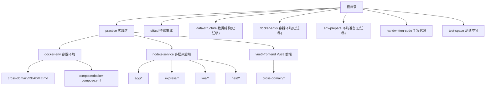
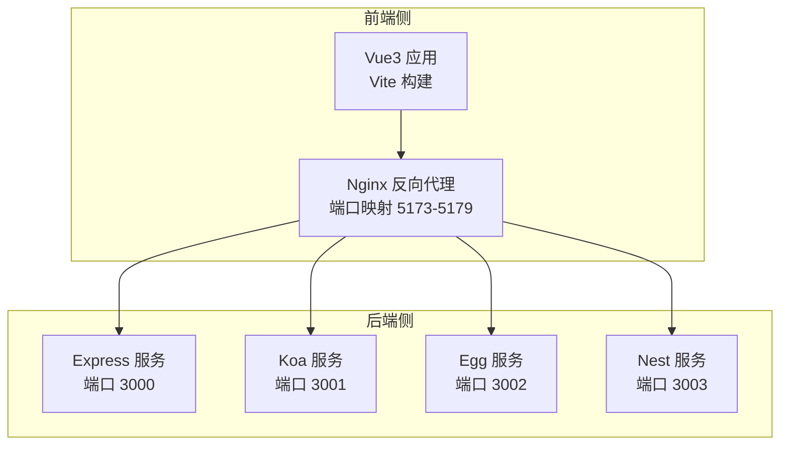
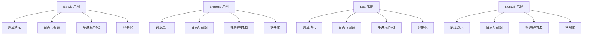
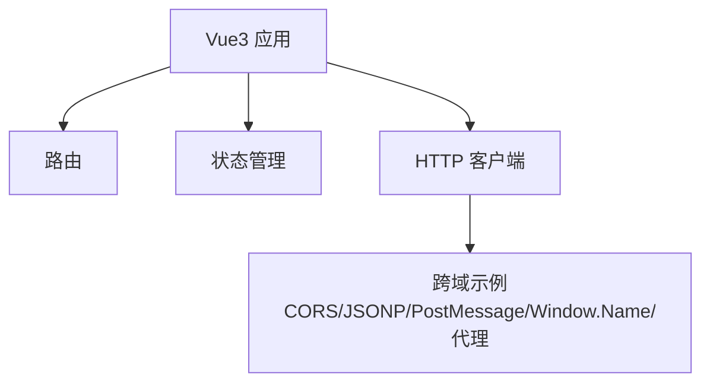
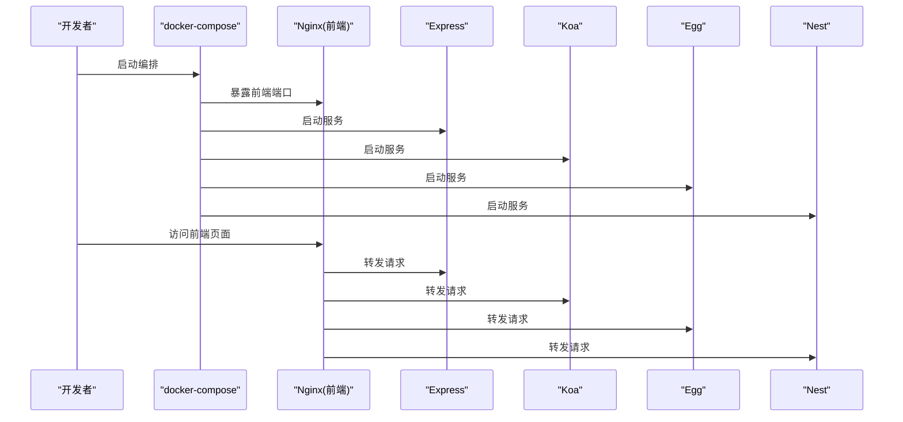
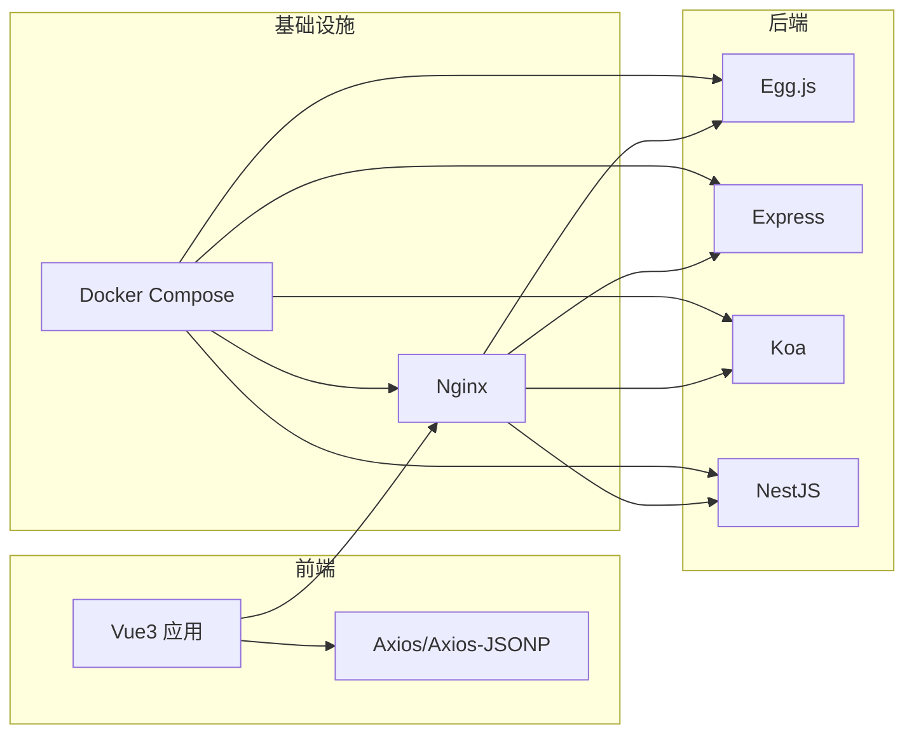

# 项目介绍

<cite>
**本文引用的文件**   
- [README.md](file://README.md)
- [README.zh-CN.md](file://README.zh-CN.md)
- [practice/README.md](file://practice/README.md)
- [practice/README.zh-CN.md](file://practice/README.zh-CN.md)
- [practice/docker-env/cross-domain/README.md](file://practice/docker-env/cross-domain/README.md)
- [practice/docker-env/cross-domain/compose/docker-compose.yml](file://practice/docker-env/cross-domain/compose/docker-compose.yml)
- [practice/nodejs-service/egg/cross-domain/package.json](file://practice/nodejs-service/egg/cross-domain/package.json)
- [practice/vue3-frontend/cross-domain/package.json](file://practice/vue3-frontend/cross-domain/package.json)
</cite>

## 目录
1. [引言](#引言)
2. [项目结构](#项目结构)
3. [核心组件](#核心组件)
4. [架构总览](#架构总览)
5. [详细组件分析](#详细组件分析)
6. [依赖关系分析](#依赖关系分析)
7. [性能考虑](#性能考虑)
8. [故障排查指南](#故障排查指南)
9. [结论](#结论)
10. [附录](#附录)

## 引言
Collection-Space 是一个综合性 Web 开发示例项目的集合，旨在通过真实可运行的多框架后端与前端实践，帮助开发者系统掌握现代 Web 技术栈与工程化能力。项目覆盖多种主流后端框架（Egg.js、Express、Koa、NestJS），以及基于 Vue3 的前端应用，并围绕“跨域处理”“容器化部署”“日志与请求追踪”“多进程与 PM2 运行”等企业级主题提供可复用的工程模板与最佳实践。

项目的核心价值在于：
- 提供多框架后端服务的对比与对照示例，便于团队选型与迁移参考
- 展示从本地开发到容器化部署的完整链路，降低工程化门槛
- 集成跨域处理的多种方案（CORS、JSONP、PostMessage、Window.Name、代理等），帮助理解浏览器同源策略与解决方案
- 以模块化方式组织代码，强调可扩展性与可维护性，适合进阶学习与团队协作

学习目标包括：
- 熟悉 Egg.js、Express、Koa、NestJS 的典型配置与中间件模式
- 掌握 Vue3 前端工程的构建、路由、状态管理与跨域交互
- 理解跨域问题的本质与多种工程化解决方案
- 学会使用 Docker Compose 搭建多服务联调环境
- 了解请求追踪、日志记录、多进程与 PM2 运行等生产实践

适用人群与学习路径建议：
- 初学者：先从 Vue3 前端与 Egg.js 示例入手，理解前后端交互与基础工程化
- 进阶者：对比 Express/Koa/NestJS 示例，结合跨域与容器化实践，完成端到端联调
- 团队/技术负责人：参考 CI/CD 与容器化模板，快速搭建标准化开发与发布流程

## 项目结构
项目采用按“实践领域”分层的组织方式，核心目录与职责如下：
- practice：实践区，包含 Docker 环境、Node.js 服务示例（多框架）、Vue3 前端示例
- ci&cd：持续集成与持续部署相关脚本
- data-structure、docker-envs、env-prepare：历史或迁移内容，当前已标注迁移
- handwritten-code：手写代码示例（如函数式编程与 TypeScript 练习）
- test-space：各组件库的测试空间
- 根目录 README：总体路径规划与 API 文档入口

图表来源
- [README.md:1-18](file://README.md#L1-L18)
- [practice/README.md:1-26](file://practice/README.md#L1-L26)
- [practice/docker-env/cross-domain/README.md:1-18](file://practice/docker-env/cross-domain/README.md#L1-L18)
- [practice/docker-env/cross-domain/compose/docker-compose.yml:1-67](file://practice/docker-env/cross-domain/compose/docker-compose.yml#L1-L67)

章节来源
- [README.md:1-18](file://README.md#L1-L18)
- [README.zh-CN.md:1-18](file://README.zh-CN.md#L1-L18)
- [practice/README.md:1-26](file://practice/README.md#L1-L26)
- [practice/README.zh-CN.md:1-34](file://practice/README.zh-CN.md#L1-L34)

## 核心组件
- 多框架后端服务（Egg.js、Express、Koa、NestJS）：每个框架均提供跨域演示、请求追踪、日志记录、多进程/PM2 运行等常见企业级能力的最小可用示例，便于横向对比与快速上手
- Vue3 前端应用：基于 Vite 构建，集成路由、状态管理与跨域交互示例，涵盖 CORS、JSONP、PostMessage、Window.Name、代理等多种跨域场景
- Docker 环境：通过 docker-compose 将 Nginx（前端）、Express、Koa、Egg、Nest 等服务统一编排，一键启动多端联调环境
- 跨域处理方案：集中展示浏览器同源策略与工程化解决方案，配合 Nginx 反向代理与后端中间件实现安全可控的跨域实践

章节来源
- [practice/README.md:12-26](file://practice/README.md#L12-L26)
- [practice/README.zh-CN.md:20-34](file://practice/README.zh-CN.md#L20-L34)
- [practice/docker-env/cross-domain/README.md:1-18](file://practice/docker-env/cross-domain/README.md#L1-L18)
- [practice/docker-env/cross-domain/compose/docker-compose.yml:1-67](file://practice/docker-env/cross-domain/compose/docker-compose.yml#L1-L67)

## 架构总览
下图展示了跨域联调的整体架构：前端通过 Nginx 暴露的域名与端口访问，后端由 Express/Koa/Egg/Nest 分别提供接口；Docker Compose 统一编排，便于本地联调与演示。

图表来源
- [practice/docker-env/cross-domain/compose/docker-compose.yml:1-67](file://practice/docker-env/cross-domain/compose/docker-compose.yml#L1-L67)

## 详细组件分析

### 多框架后端服务（Egg.js、Express、Koa、NestJS）
- 共同特性
  - 跨域演示：提供 CORS、JSONP 等跨域处理示例，便于理解不同方案的适用场景
  - 请求追踪与日志：集成请求 ID 与日志中间件，支持控制台与第三方日志库
  - 多进程与 PM2：提供 cluster 与 pm2 的运行示例，便于生产环境部署
  - 容器化：每个框架均提供 dockerfile 与 docker-compose 编排，支持一键启动
- Egg.js
  - 特点：插件生态丰富，支持 TypeScript 与 Tegg 模块化
  - 示例：跨域、请求追踪、日志、多进程、容器化
- Express
  - 特点：轻量灵活，中间件体系成熟
  - 示例：跨域（CORS/JSONP）、日志（Morgan/Log4js）、多进程与 PM2
- Koa
  - 特点：更现代的中间件模型，异步流程更清晰
  - 示例：跨域、请求 ID、日志、多进程与 PM2
- NestJS
  - 特点：基于 TypeScript 的企业级架构，模块化与依赖注入
  - 示例：跨域、请求 ID、日志、多进程与 PM2

图表来源
- [practice/README.md:12-26](file://practice/README.md#L12-L26)
- [practice/README.zh-CN.md:20-34](file://practice/README.zh-CN.md#L20-L34)
- [practice/nodejs-service/egg/cross-domain/package.json:1-58](file://practice/nodejs-service/egg/cross-domain/package.json#L1-L58)

章节来源
- [practice/README.md:12-26](file://practice/README.md#L12-L26)
- [practice/README.zh-CN.md:20-34](file://practice/README.zh-CN.md#L20-L34)
- [practice/nodejs-service/egg/cross-domain/package.json:1-58](file://practice/nodejs-service/egg/cross-domain/package.json#L1-L58)

### Vue3 前端应用与跨域交互
- 技术栈：Vue3、Vite、Vue Router、Pinia、Axios/Axios-JSONP
- 能力范围：路由导航、状态管理、跨域交互示例（CORS、JSONP、PostMessage、Window.Name、代理）
- 工程化：TypeScript、ESLint、Prettier、类型检查与构建预览

图表来源
- [practice/vue3-frontend/cross-domain/package.json:1-43](file://practice/vue3-frontend/cross-domain/package.json#L1-L43)

章节来源
- [practice/vue3-frontend/cross-domain/package.json:1-43](file://practice/vue3-frontend/cross-domain/package.json#L1-L43)

### Docker 环境与编排
- 通过 docker-compose 将前端（Nginx）与多个后端服务（Express/Koa/Egg/Nest）统一编排
- 支持一键启动与停止，便于本地联调与演示
- 日志挂载：Nginx 访问日志持久化到宿主机

图表来源
- [practice/docker-env/cross-domain/compose/docker-compose.yml:1-67](file://practice/docker-env/cross-domain/compose/docker-compose.yml#L1-L67)

章节来源
- [practice/docker-env/cross-domain/README.md:1-18](file://practice/docker-env/cross-domain/README.md#L1-L18)
- [practice/docker-env/cross-domain/compose/docker-compose.yml:1-67](file://practice/docker-env/cross-domain/compose/docker-compose.yml#L1-L67)

## 依赖关系分析
- 组件内聚与解耦
  - 后端各框架示例相互独立，仅共享“跨域演示”这一公共主题，便于对比学习
  - 前端与后端通过 Nginx 代理解耦，便于替换与扩展
- 外部依赖
  - 后端：Egg.js、Express、Koa、NestJS 生态中的跨域、日志、多进程相关依赖
  - 前端：Vue3、Vite、Axios/Axios-JSONP、Ant Design Vue 等
- 容器化依赖
  - Docker 与 docker-compose 用于环境编排与服务发现

图表来源
- [practice/docker-env/cross-domain/compose/docker-compose.yml:1-67](file://practice/docker-env/cross-domain/compose/docker-compose.yml#L1-L67)
- [practice/vue3-frontend/cross-domain/package.json:1-43](file://practice/vue3-frontend/cross-domain/package.json#L1-L43)
- [practice/nodejs-service/egg/cross-domain/package.json:1-58](file://practice/nodejs-service/egg/cross-domain/package.json#L1-L58)

章节来源
- [practice/docker-env/cross-domain/compose/docker-compose.yml:1-67](file://practice/docker-env/cross-domain/compose/docker-compose.yml#L1-L67)
- [practice/vue3-frontend/cross-domain/package.json:1-43](file://practice/vue3-frontend/cross-domain/package.json#L1-L43)
- [practice/nodejs-service/egg/cross-domain/package.json:1-58](file://practice/nodejs-service/egg/cross-domain/package.json#L1-L58)

## 性能考虑
- 服务端
  - 多进程与 PM2：合理利用 CPU 核心，提升并发处理能力
  - 中间件顺序：将高开销中间件置于靠后位置，减少对高频路径的影响
  - 日志与追踪：避免在热路径中进行重 IO 操作，必要时采用异步写入或缓冲
- 前端
  - 构建优化：启用压缩与 Tree-Shaking，拆分路由与组件，按需加载
  - 跨域代理：在开发阶段使用反向代理，减少浏览器跨域带来的额外握手成本
- 容器化
  - 资源限制：为各服务设置合理的内存与 CPU 限制，避免资源争抢
  - 端口与网络：统一端口映射与网络别名，降低联调复杂度

## 故障排查指南
- 启动失败
  - 检查 docker-compose 是否正确构建镜像与端口映射
  - 查看 Nginx 与后端服务的日志输出，确认监听端口是否被占用
- 跨域问题
  - 确认前端请求域名与端口与 Nginx 配置一致
  - 核对后端 CORS 配置与允许的来源列表
- 请求追踪
  - 在请求头中携带请求 ID，结合后端日志定位具体请求链路
- 多进程与 PM2
  - 关注进程健康状态与重启策略，避免因单点故障影响整体服务

## 结论
Collection-Space 通过多框架后端与 Vue3 前端的组合实践，系统呈现了现代 Web 开发的关键环节：工程化、跨域处理、容器化与企业级能力（日志、追踪、多进程）。它既适合个人学习与技能拓展，也可作为团队内部的技术参考与培训素材。建议从 Vue3 前端与 Egg.js 示例开始，逐步深入到 Express/Koa/Nest 的对比实践，并结合 Docker 环境完成端到端联调。

## 附录
- 快速启动
  - 进入跨域演示环境，执行启动脚本，等待容器编排完成
  - 打开端口映射对应的地址，观察前端页面与后端接口响应
- API 文档
  - 后端接口可在指定平台查看与调试，便于快速验证

章节来源
- [practice/docker-env/cross-domain/README.md:1-18](file://practice/docker-env/cross-domain/README.md#L1-L18)
- [README.md:15-15](file://README.md#L15-L15)
- [README.zh-CN.md:15-15](file://README.zh-CN.md#L15-L15)