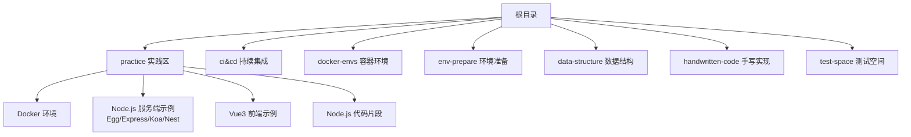
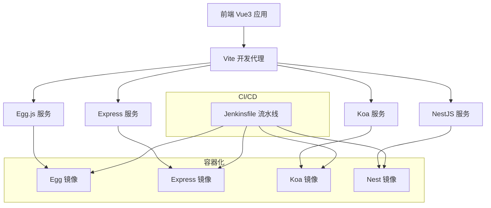
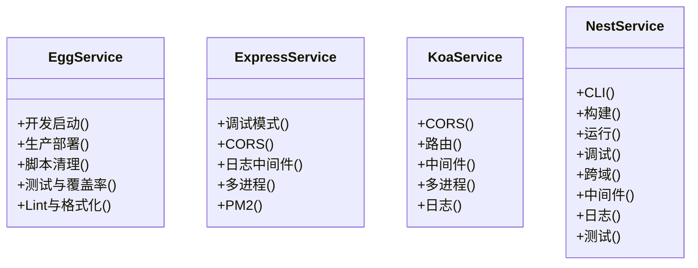
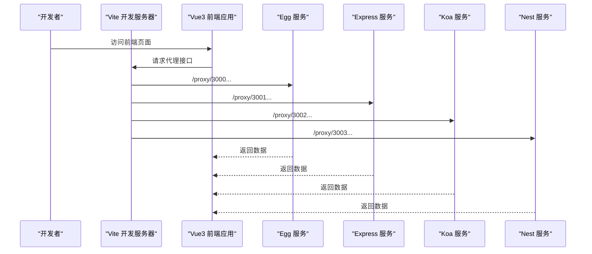
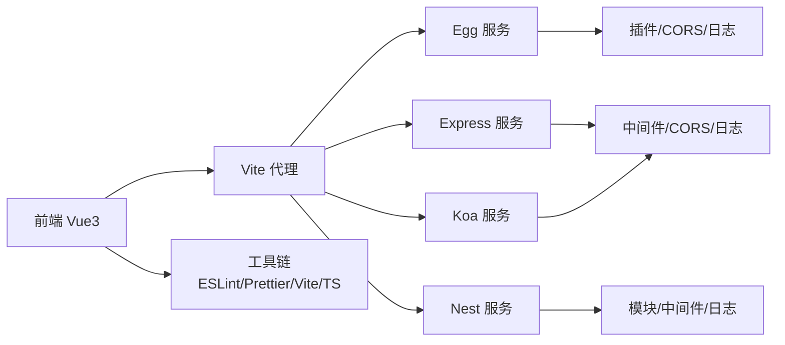

# 项目概述

<cite>
**本文引用的文件**
- [README.md](file://README.md)
- [README.zh-CN.md](file://README.zh-CN.md)
- [practice/README.md](file://practice/README.md)
- [practice/README.zh-CN.md](file://practice/README.zh-CN.md)
- [practice/nodejs-service/egg/cross-domain/package.json](file://practice/nodejs-service/egg/cross-domain/package.json)
- [practice/nodejs-service/express/cross-domain/package.json](file://practice/nodejs-service/express/cross-domain/package.json)
- [practice/nodejs-service/koa/cross-domain/package.json](file://practice/nodejs-service/koa/cross-domain/package.json)
- [practice/nodejs-service/nest/cross-domain/package.json](file://practice/nodejs-service/nest/cross-domain/package.json)
- [practice/vue3-frontend/cross-domain/package.json](file://practice/vue3-frontend/cross-domain/package.json)
- [practice/vue3-frontend/cross-domain/vite.config.ts](file://practice/vue3-frontend/cross-domain/vite.config.ts)
- [practice/vue3-frontend/cross-domain/src/main.ts](file://practice/vue3-frontend/cross-domain/src/main.ts)
- [ci&cd/jenkins/jenkinsfile/README.md](file://ci&cd/jenkins/jenkinsfile/README.md)
- [docker-envs/README.md](file://docker-envs/README.md)
- [docker-envs/README.zh-CN.md](file://docker-envs/README.zh-CN.md)
- [env-prepare/README.md](file://env-prepare/README.md)
- [env-prepare/README.zh-CN.md](file://env-prepare/README.zh-CN.md)
- [data-structure/README.md](file://data-structure/README.md)
- [data-structure/README.zh-CN.md](file://data-structure/README.zh-CN.md)
- [handwritten-code/package.json](file://handwritten-code/package.json)
</cite>

## 目录
1. [引言](#引言)
2. [项目结构](#项目结构)
3. [核心组件](#核心组件)
4. [架构总览](#架构总览)
5. [详细组件分析](#详细组件分析)
6. [依赖关系分析](#依赖关系分析)
7. [性能考虑](#性能考虑)
8. [故障排查指南](#故障排查指南)
9. [结论](#结论)
10. [附录](#附录)

## 引言
Collection-Space 是一个面向 Web 全栈学习与实践的综合性示例工程集合，旨在通过多后端框架（Egg.js、Express、Koa、NestJS）、前端 Vue3 应用、跨域处理演示以及容器化与 CI/CD 流水线，帮助不同层次的开发者建立系统性的工程化认知与实操能力。项目强调“多框架并行对比”“前后端联调”“企业级能力示例”“可复用的工程模板”，既适合入门者循序渐进地掌握主流技术栈，也为有经验的工程师提供可迁移的最佳实践参考。

## 项目结构
项目采用按主题与技术栈分层的组织方式，核心目录与职责如下：
- practice：实践区，包含 Docker 环境、多后端框架示例、Vue3 前端示例与代码片段
- ci&cd：持续集成与持续交付相关脚本与 Jenkins 配置
- docker-envs：容器环境说明与指引
- env-prepare：环境准备脚本
- data-structure：数据结构相关内容（已迁移）
- handwritten-code：手写实现示例（如函数式编程与 TypeScript 工具类型）
- test-space：各组件库的测试空间
- 根目录文档：项目总体说明与中文说明

图表来源
- [README.md:1-18](file://README.md#L1-L18)
- [README.zh-CN.md:1-18](file://README.zh-CN.md#L1-L18)
- [practice/README.md:1-26](file://practice/README.md#L1-L26)
- [practice/README.zh-CN.md:1-34](file://practice/README.zh-CN.md#L1-L34)

章节来源
- [README.md:1-18](file://README.md#L1-L18)
- [README.zh-CN.md:1-18](file://README.zh-CN.md#L1-L18)
- [practice/README.md:1-26](file://practice/README.md#L1-L26)
- [practice/README.zh-CN.md:1-34](file://practice/README.zh-CN.md#L1-L34)

## 核心组件
- 多后端框架示例
  - Egg.js：提供 TypeScript 支持、中间件、插件生态与生产脚本
  - Express：最小可用骨架、跨域与日志中间件示例
  - Koa：轻量内核、中间件生态与多进程示例
  - NestJS：模块化架构、控制器/服务/中间件、测试与构建流程
- 前端 Vue3 示例
  - Vite 构建、Vue Router/Pinia、Ant Design Vue 集成
  - 开发代理配置，统一代理到多端口后端服务
- 跨域处理演示
  - 前端侧：Vite 代理、postMessage、window.name、JSONP、document.domain
  - 后端侧：CORS、跨域中间件
- 容器化与工程化
  - Dockerfile 示例与 docker-compose 环境
  - Node.js 多框架镜像构建
- CI/CD 流水线
  - Jenkinsfile 多服务/网站流水线示例

章节来源
- [practice/README.md:12-26](file://practice/README.md#L12-L26)
- [practice/README.zh-CN.md:20-34](file://practice/README.zh-CN.md#L20-L34)
- [practice/nodejs-service/egg/cross-domain/package.json:1-58](file://practice/nodejs-service/egg/cross-domain/package.json#L1-L58)
- [practice/nodejs-service/express/cross-domain/package.json:1-25](file://practice/nodejs-service/express/cross-domain/package.json#L1-L25)
- [practice/nodejs-service/koa/cross-domain/package.json:1-23](file://practice/nodejs-service/koa/cross-domain/package.json#L1-L23)
- [practice/nodejs-service/nest/cross-domain/package.json:1-71](file://practice/nodejs-service/nest/cross-domain/package.json#L1-L71)
- [practice/vue3-frontend/cross-domain/package.json:1-43](file://practice/vue3-frontend/cross-domain/package.json#L1-L43)
- [practice/vue3-frontend/cross-domain/vite.config.ts:1-40](file://practice/vue3-frontend/cross-domain/vite.config.ts#L1-L40)

## 架构总览
整体架构以“多框架并行 + 前后端联调 + 容器化 + 自动化”为核心设计思想，形成可扩展、可迁移、可验证的工程化闭环。

图表来源
- [practice/vue3-frontend/cross-domain/vite.config.ts:15-38](file://practice/vue3-frontend/cross-domain/vite.config.ts#L15-L38)
- [practice/nodejs-service/egg/cross-domain/package.json:9-22](file://practice/nodejs-service/egg/cross-domain/package.json#L9-L22)
- [practice/nodejs-service/express/cross-domain/package.json:5-9](file://practice/nodejs-service/express/cross-domain/package.json#L5-L9)
- [practice/nodejs-service/koa/cross-domain/package.json:5-9](file://practice/nodejs-service/koa/cross-domain/package.json#L5-L9)
- [practice/nodejs-service/nest/cross-domain/package.json:8-21](file://practice/nodejs-service/nest/cross-domain/package.json#L8-L21)
- [ci&cd/jenkins/jenkinsfile/README.md](file://ci&cd/jenkins/jenkinsfile/README.md)

## 详细组件分析

### 多后端框架对比与实践要点
- Egg.js
  - 特点：插件化、TypeScript 友好、生产脚本、AOP/事件总线等企业级能力
  - 关键点：开发启动、生产部署、脚本清理、测试与覆盖率、Lint/Prettier
- Express
  - 特点：极简、中间件丰富、跨域与日志中间件示例齐全
  - 关键点：调试开关、CORS、Morgan 日志、多进程/PM2
- Koa
  - 特点：更轻量、更现代的中间件模型、多进程示例
  - 关键点：@koa/cors、@koa/router、console/log4js 中间件
- NestJS
  - 特点：模块化架构、强类型、内置测试与 Jest 配置
  - 关键点：CLI、构建/运行/调试、跨域、中间件、日志

图表来源
- [practice/nodejs-service/egg/cross-domain/package.json:9-22](file://practice/nodejs-service/egg/cross-domain/package.json#L9-L22)
- [practice/nodejs-service/express/cross-domain/package.json:5-9](file://practice/nodejs-service/express/cross-domain/package.json#L5-L9)
- [practice/nodejs-service/koa/cross-domain/package.json:5-9](file://practice/nodejs-service/koa/cross-domain/package.json#L5-L9)
- [practice/nodejs-service/nest/cross-domain/package.json:8-21](file://practice/nodejs-service/nest/cross-domain/package.json#L8-L21)

章节来源
- [practice/nodejs-service/egg/cross-domain/package.json:1-58](file://practice/nodejs-service/egg/cross-domain/package.json#L1-L58)
- [practice/nodejs-service/express/cross-domain/package.json:1-25](file://practice/nodejs-service/express/cross-domain/package.json#L1-L25)
- [practice/nodejs-service/koa/cross-domain/package.json:1-23](file://practice/nodejs-service/koa/cross-domain/package.json#L1-L23)
- [practice/nodejs-service/nest/cross-domain/package.json:1-71](file://practice/nodejs-service/nest/cross-domain/package.json#L1-L71)

### 前端 Vue3 与跨域演示
- 技术栈：Vite、Vue 3、Vue Router、Pinia、Ant Design Vue
- 开发体验：热更新、类型检查、ESLint/Prettier、预览与构建
- 跨域演示：Vite 代理统一转发到多后端端口；前端还提供 postMessage、window.name、JSONP、document.domain 等方案示例页面

图表来源
- [practice/vue3-frontend/cross-domain/vite.config.ts:15-38](file://practice/vue3-frontend/cross-domain/vite.config.ts#L15-L38)
- [practice/vue3-frontend/cross-domain/src/main.ts:1-16](file://practice/vue3-frontend/cross-domain/src/main.ts#L1-L16)

章节来源
- [practice/vue3-frontend/cross-domain/package.json:1-43](file://practice/vue3-frontend/cross-domain/package.json#L1-L43)
- [practice/vue3-frontend/cross-domain/vite.config.ts:1-40](file://practice/vue3-frontend/cross-domain/vite.config.ts#L1-L40)
- [practice/vue3-frontend/cross-domain/src/main.ts:1-16](file://practice/vue3-frontend/cross-domain/src/main.ts#L1-L16)

### 容器化与工程化
- Dockerfile 示例覆盖多框架，便于本地快速构建镜像
- docker-compose 环境用于跨域演示与多服务编排
- 环境准备脚本与容器环境说明，降低工程搭建门槛

章节来源
- [docker-envs/README.md](file://docker-envs/README.md)
- [docker-envs/README.zh-CN.md](file://docker-envs/README.zh-CN.md)
- [env-prepare/README.md](file://env-prepare/README.md)
- [env-prepare/README.zh-CN.md](file://env-prepare/README.zh-CN.md)

### CI/CD 流水线
- Jenkinsfile 提供多服务/网站的流水线样例，便于在团队中标准化构建、测试与发布流程

章节来源
- [ci&cd/jenkins/jenkinsfile/README.md](file://ci&cd/jenkins/jenkinsfile/README.md)

## 依赖关系分析
- 前端对后端的依赖：通过 Vite 代理集中访问多后端服务，避免浏览器同源限制
- 后端对中间件/插件的依赖：跨域、日志、请求 ID 等中间件/插件贯穿多框架
- 工程工具链：ESLint、Prettier、TypeScript、Jest、Vite 等统一规范与质量保障

图表来源
- [practice/vue3-frontend/cross-domain/vite.config.ts:15-38](file://practice/vue3-frontend/cross-domain/vite.config.ts#L15-L38)
- [practice/nodejs-service/egg/cross-domain/package.json:32-34](file://practice/nodejs-service/egg/cross-domain/package.json#L32-L34)
- [practice/nodejs-service/express/cross-domain/package.json:10-16](file://practice/nodejs-service/express/cross-domain/package.json#L10-L16)
- [practice/nodejs-service/koa/cross-domain/package.json:10-14](file://practice/nodejs-service/koa/cross-domain/package.json#L10-L14)
- [practice/nodejs-service/nest/cross-domain/package.json:22-29](file://practice/nodejs-service/nest/cross-domain/package.json#L22-L29)

## 性能考虑
- 服务端
  - 多进程/集群与 PM2：提升并发与稳定性
  - 中间件粒度控制：仅加载必要中间件，减少请求链路开销
  - 生产脚本与健康检查：结合容器探针与日志监控
- 前端
  - 代理策略：合理设置 rewrite 与 changeOrigin，避免多余重定向
  - 构建优化：Vite 默认优化，按需引入组件库样式
- 容器化
  - 多阶段构建与镜像瘦身，缩短拉取与启动时间

## 故障排查指南
- 跨域问题
  - 后端确认 CORS 配置生效，前端代理目标地址与端口正确
- 代理不通
  - 检查 Vite 代理规则是否覆盖目标端口，rewrite 是否匹配
- 服务无法启动
  - 校验 Node 版本与依赖安装，查看生产脚本与日志输出
- CI/CD 失败
  - 查看 Jenkins 流水线日志，定位构建/测试/打包阶段错误

## 结论
Collection-Space 通过“多框架并行 + 前后端联调 + 容器化 + 自动化”的组合拳，提供了从入门到进阶的完整学习路径与可落地的企业级实践范式。建议初学者先从前端代理与跨域演示入手，再逐步深入各后端框架的中间件与工程化配置；有经验的开发者可基于此模板快速搭建新项目骨架，并将 CI/CD 与容器化流程标准化。

## 附录
- 学习路径建议
  - 入门：阅读前端跨域演示与代理配置，理解同源与代理机制
  - 进阶：分别运行 Egg/Express/Koa/Nest 的示例服务，对比中间件与日志方案
  - 企业级：引入容器化与 CI/CD 流水线，完善测试与质量门禁
- 最佳实践
  - 统一工具链：ESLint/Prettier/TypeScript/Jest
  - 明确中间件边界：CORS、日志、请求 ID、异常处理
  - 代理与路由：保持简洁明确，避免复杂 rewrite
  - 容器镜像：多阶段构建、最小化依赖、健康检查