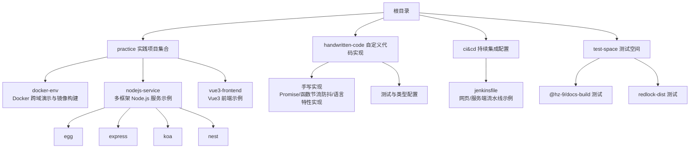
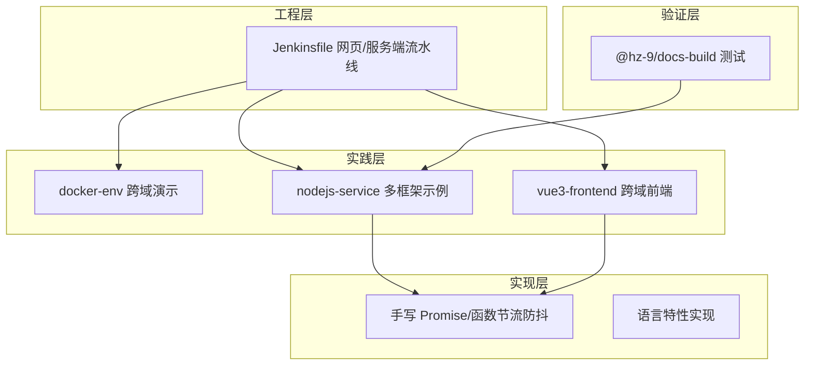
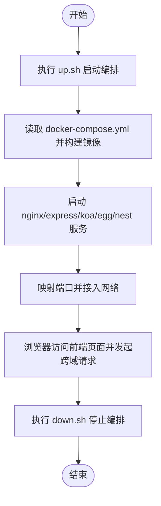
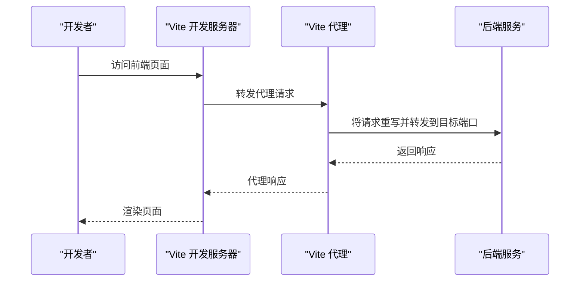
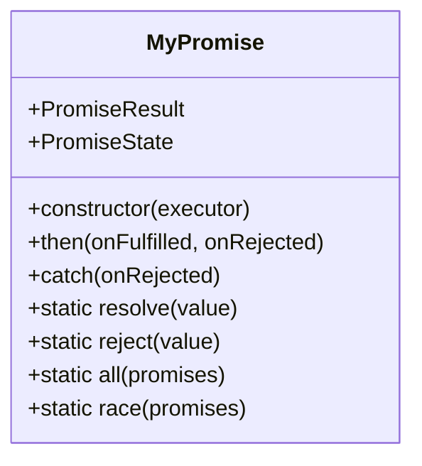
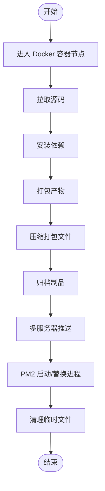
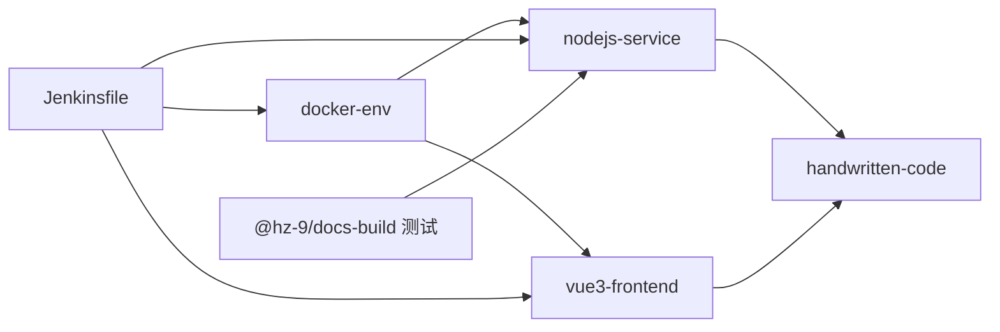

# 项目结构

<cite>
**本文引用的文件**
- [README.md](file://README.md)
- [README.zh-CN.md](file://README.zh-CN.md)
- [build.sh](file://build.sh)
- [practice/README.md](file://practice/README.md)
- [practice/README.zh-CN.md](file://practice/README.zh-CN.md)
- [practice/docker-env/cross-domain/README.md](file://practice/docker-env/cross-domain/README.md)
- [practice/docker-env/cross-domain/compose/docker-compose.yml](file://practice/docker-env/cross-domain/compose/docker-compose.yml)
- [practice/vue3-frontend/cross-domain/README.md](file://practice/vue3-frontend/cross-domain/README.md)
- [practice/vue3-frontend/cross-domain/vite.config.ts](file://practice/vue3-frontend/cross-domain/vite.config.ts)
- [handwritten-code/package.json](file://handwritten-code/package.json)
- [handwritten-code/src/my-promise.ts](file://handwritten-code/src/my-promise.ts)
- [ci&cd/jenkins/jenkinsfile/README.md](file://ci&cd/jenkins/jenkinsfile/README.md)
- [ci&cd/jenkins/jenkinsfile/service.1.Jenkinsfile](file://ci&cd/jenkins/jenkinsfile/service.1.Jenkinsfile)
- [test-space/hz-9/docs-build/ts-node18-cjs/README.md](file://test-space/hz-9/docs-build/ts-node18-cjs/README.md)
</cite>

## 目录
1. [简介](#简介)
2. [项目结构](#项目结构)
3. [核心组件](#核心组件)
4. [架构总览](#架构总览)
5. [详细组件分析](#详细组件分析)
6. [依赖分析](#依赖分析)
7. [性能考虑](#性能考虑)
8. [故障排查指南](#故障排查指南)
9. [结论](#结论)
10. [附录](#附录)

## 简介
本仓库是面向 Web 开发的脚本与示例集合，围绕“实践”“自定义实现”“持续集成/持续交付”“测试空间”四大主题组织内容。其目标是帮助开发者快速定位到所需示例与配置，并通过统一的结构与导航指南高效开展学习与开发。

- 路径规划与职责概览
  - practice：实践项目集合，涵盖 Docker 跨域演示环境、多框架 Node.js 服务示例、Vue3 前端示例等。
  - handwritten-code：自定义代码实现，如手写 Promise、函数节流防抖等经典算法与语言特性实现。
  - ci&cd：持续集成/持续交付配置，包含 Jenkinsfile 示例，覆盖网页与服务端流水线。
  - test-space：各类组件库的测试空间，用于验证构建与文档生成等场景。

章节来源
- [README.md:1-18](file://README.md#L1-L18)
- [README.zh-CN.md:1-18](file://README.zh-CN.md#L1-L18)

## 项目结构
- 顶层说明与路径规划
  - 顶层 README 提供英文与中文双语的路径规划，明确各目录的职责与迁移去向。
- practice 实践项目集合
  - docker-env：Docker 跨域演示与镜像构建示例，包含 Nginx 与多后端服务编排。
  - nodejs-service：多框架 Node.js 服务示例（egg、express、koa、nest），覆盖跨域、日志、请求 ID、模板等模块化实践。
  - vue3-frontend：基于 Vue3 的前端示例，包含跨域演示与 Vite 开发代理配置。
- handwritten-code 自定义代码实现
  - 包含手写 Promise、函数节流防抖、call/bind/apply/instanceof/new 等实现，配套测试与 TypeScript 配置。
- ci&cd 持续集成配置
  - jenkinsfile：提供网页与服务端流水线示例，展示安装、打包、归档与部署流程。
- test-space 测试空间
  - hz-9：针对特定库的测试用例与构建配置，如文档构建与分布式锁相关示例。

图表来源
- [README.md:5-15](file://README.md#L5-L15)
- [practice/README.md:1-26](file://practice/README.md#L1-L26)
- [practice/README.zh-CN.md:1-34](file://practice/README.zh-CN.md#L1-L34)

章节来源
- [README.md:1-18](file://README.md#L1-L18)
- [README.zh-CN.md:1-18](file://README.zh-CN.md#L1-L18)
- [practice/README.md:1-26](file://practice/README.md#L1-L26)
- [practice/README.zh-CN.md:1-34](file://practice/README.zh-CN.md#L1-L34)

## 核心组件
- practice 实践项目集合
  - docker-env：提供跨域演示与多后端服务编排，便于理解不同框架在容器中的协作方式。
  - nodejs-service：以 egg/express/koa/nest 为例，展示跨域、请求 ID、日志、模板等模块化实践。
  - vue3-frontend：基于 Vue3 的前端示例，包含跨域演示与 Vite 代理配置。
- handwritten-code 自定义代码实现
  - 手写 Promise：完整实现状态机、链式调用、静态方法与规范兼容逻辑。
  - 函数节流防抖：常见性能优化手段的实现与测试。
  - 语言特性实现：call/bind/apply/instanceof/new 等核心能力的手写版本。
- ci&cd 持续集成配置
  - Jenkinsfile：覆盖网页与服务端流水线，包含安装依赖、打包、归档与部署步骤。
- test-space 测试空间
  - 文档构建与组件库测试：验证单仓文档构建与特定库的测试场景。

章节来源
- [practice/README.md:12-26](file://practice/README.md#L12-L26)
- [practice/README.zh-CN.md:20-34](file://practice/README.zh-CN.md#L20-L34)
- [handwritten-code/package.json:1-23](file://handwritten-code/package.json#L1-L23)
- [handwritten-code/src/my-promise.ts:1-237](file://handwritten-code/src/my-promise.ts#L1-L237)
- [ci&cd/jenkins/jenkinsfile/README.md:1-24](file://ci&cd/jenkins/jenkinsfile/README.md#L1-L24)
- [test-space/hz-9/docs-build/ts-node18-cjs/README.md:1-4](file://test-space/hz-9/docs-build/ts-node18-cjs/README.md#L1-L4)

## 架构总览
从整体上，本仓库采用“主题分层 + 子项目并行”的组织方式：
- practice：以“可运行示例”为核心，强调可复现与可对比（多框架、跨域、容器编排）。
- handwritten-code：以“能力验证”为核心，强调实现细节与测试覆盖。
- ci&cd：以“自动化流水线”为核心，强调可重复与可部署。
- test-space：以“验证与回归”为核心，强调对特定库或场景的专项测试。

图表来源
- [practice/README.md:3-26](file://practice/README.md#L3-L26)
- [handwritten-code/package.json:8-11](file://handwritten-code/package.json#L8-L11)
- [ci&cd/jenkins/jenkinsfile/README.md:3-24](file://ci&cd/jenkins/jenkinsfile/README.md#L3-L24)
- [test-space/hz-9/docs-build/ts-node18-cjs/README.md:1-4](file://test-space/hz-9/docs-build/ts-node18-cjs/README.md#L1-L4)

## 详细组件分析

### practice/docker-env：Docker 跨域演示与镜像构建
- 功能职责
  - 提供 Nginx 与多后端服务（Express/Koa/Egg/Nest）的跨域演示环境。
  - 通过 docker-compose 编排，一键启动/停止，便于对比不同后端框架在跨域场景下的行为。
- 关键文件
  - docker-compose 编排文件：定义服务镜像构建上下文、端口映射、网络与卷挂载。
  - 启停脚本：封装 up/down 流程，便于快速体验。
- 运行流程
  - 通过编排文件构建各服务镜像并暴露端口，Nginx 作为反向代理，前端通过代理访问后端接口，验证跨域策略。

图表来源
- [practice/docker-env/cross-domain/README.md:5-17](file://practice/docker-env/cross-domain/README.md#L5-L17)
- [practice/docker-env/cross-domain/compose/docker-compose.yml:1-67](file://practice/docker-env/cross-domain/compose/docker-compose.yml#L1-L67)

章节来源
- [practice/docker-env/cross-domain/README.md:1-18](file://practice/docker-env/cross-domain/README.md#L1-L18)
- [practice/docker-env/cross-domain/compose/docker-compose.yml:1-67](file://practice/docker-env/cross-domain/compose/docker-compose.yml#L1-L67)

### practice/nodejs-service：多框架 Node.js 服务示例
- 功能职责
  - 以 egg/express/koa/nest 为例，展示跨域、请求 ID、日志、模板等模块化实践。
  - 每个框架下包含 cross-domain、request-id、request-log、template 等子示例，便于横向对比。
- 关键点
  - 统一的启动脚本与配置风格，便于快速切换与对比。
  - 支持 Docker 镜像构建与多进程部署（cluster/pm2）示例。

章节来源
- [practice/README.md:12-26](file://practice/README.md#L12-L26)
- [practice/README.zh-CN.md:20-34](file://practice/README.zh-CN.md#L20-L34)

### practice/vue3-frontend：Vue3 前端跨域示例
- 功能职责
  - 基于 Vue3 的前端示例，包含跨域演示与 Vite 开发代理配置。
  - 通过代理将前端请求转发至不同端口的后端服务，验证跨域策略与开发调试流程。
- 关键文件
  - vite.config.ts：配置多目标代理规则，支持本地联调。
  - README：提供安装、开发与预览命令。

图表来源
- [practice/vue3-frontend/cross-domain/vite.config.ts:15-38](file://practice/vue3-frontend/cross-domain/vite.config.ts#L15-L38)
- [practice/vue3-frontend/cross-domain/README.md:5-14](file://practice/vue3-frontend/cross-domain/README.md#L5-L14)

章节来源
- [practice/vue3-frontend/cross-domain/vite.config.ts:1-40](file://practice/vue3-frontend/cross-domain/vite.config.ts#L1-L40)
- [practice/vue3-frontend/cross-domain/README.md:1-15](file://practice/vue3-frontend/cross-domain/README.md#L1-L15)

### handwritten-code：自定义代码实现
- 功能职责
  - 手写 Promise：实现状态机、then 链式调用、静态方法与规范兼容逻辑。
  - 函数节流防抖：常见性能优化手段的实现与测试。
  - 语言特性实现：call/bind/apply/instanceof/new 等核心能力的手写版本。
- 关键点
  - 通过 TypeScript 与测试脚本保证类型安全与行为正确性。
  - 提供独立的包管理与构建配置，便于单独运行与验证。

图表来源
- [handwritten-code/src/my-promise.ts:74-236](file://handwritten-code/src/my-promise.ts#L74-L236)

章节来源
- [handwritten-code/package.json:1-23](file://handwritten-code/package.json#L1-L23)
- [handwritten-code/src/my-promise.ts:1-237](file://handwritten-code/src/my-promise.ts#L1-L237)

### ci&cd/jenkins：Jenkinsfile 示例
- 功能职责
  - 提供网页与服务端流水线示例，覆盖安装依赖、打包、归档与部署步骤。
  - 服务端流水线示例包含 PM2 部署与多服务器推送流程。
- 关键点
  - 通过 Docker 容器内执行安装与打包，确保环境一致性。
  - 归档与部署阶段分离，便于回溯与灰度发布。

图表来源
- [ci&cd/jenkins/jenkinsfile/service.1.Jenkinsfile:60-150](file://ci&cd/jenkins/jenkinsfile/service.1.Jenkinsfile#L60-L150)

章节来源
- [ci&cd/jenkins/jenkinsfile/README.md:1-24](file://ci&cd/jenkins/jenkinsfile/README.md#L1-L24)
- [ci&cd/jenkins/jenkinsfile/service.1.Jenkinsfile:1-150](file://ci&cd/jenkins/jenkinsfile/service.1.Jenkinsfile#L1-L150)

### test-space：测试空间
- 功能职责
  - 针对特定库（如 @hz-9/docs-build）的测试用例与构建配置，验证单仓文档构建效果。
- 关键点
  - 通过独立的 tsconfig 与 package.json 配置，隔离测试环境。

章节来源
- [test-space/hz-9/docs-build/ts-node18-cjs/README.md:1-4](file://test-space/hz-9/docs-build/ts-node18-cjs/README.md#L1-L4)

## 依赖分析
- 组件耦合与内聚
  - practice 内部各子项目相对独立，通过统一的 Docker 编排与前端代理形成弱耦合的对比环境。
  - handwritten-code 与 practice 在功能上互补：前者强调实现细节，后者强调可运行示例。
  - ci&cd 与 practice 强关联：流水线负责将示例打包并部署到目标服务器。
  - test-space 与 practice 的部分示例存在测试关联，用于验证构建与文档生成。
- 外部依赖与集成点
  - Docker 与 docker-compose：用于容器化编排与镜像构建。
  - Vite：用于前端开发与代理配置。
  - Jenkins：用于流水线自动化与部署。
  - PM2：用于 Node.js 服务的进程管理与部署。

图表来源
- [practice/docker-env/cross-domain/compose/docker-compose.yml:1-67](file://practice/docker-env/cross-domain/compose/docker-compose.yml#L1-L67)
- [practice/vue3-frontend/cross-domain/vite.config.ts:15-38](file://practice/vue3-frontend/cross-domain/vite.config.ts#L15-L38)
- [ci&cd/jenkins/jenkinsfile/service.1.Jenkinsfile:60-150](file://ci&cd/jenkins/jenkinsfile/service.1.Jenkinsfile#L60-L150)

章节来源
- [practice/docker-env/cross-domain/compose/docker-compose.yml:1-67](file://practice/docker-env/cross-domain/compose/docker-compose.yml#L1-L67)
- [practice/vue3-frontend/cross-domain/vite.config.ts:1-40](file://practice/vue3-frontend/cross-domain/vite.config.ts#L1-L40)
- [ci&cd/jenkins/jenkinsfile/service.1.Jenkinsfile:1-150](file://ci&cd/jenkins/jenkinsfile/service.1.Jenkinsfile#L1-L150)

## 性能考虑
- 容器编排与资源占用
  - 使用 docker-compose 启动多服务时，注意端口冲突与资源限制，避免在同一主机上同时开启过多容器。
- 前端代理与跨域
  - Vite 代理仅适用于开发环境，生产环境需通过 Nginx 或后端 CORS 配置处理跨域。
- 流水线效率
  - 在 Jenkins 中优先缓存依赖与制品，减少重复安装与打包时间；按需选择部署目标，降低部署窗口。

## 故障排查指南
- Docker 编排问题
  - 端口冲突：检查 docker-compose.yml 中的端口映射是否与其他服务冲突。
  - 权限问题：确认宿主机目录挂载权限与 SELinux 设置。
- 前端跨域问题
  - 代理未生效：核对 vite.config.ts 中的代理规则与目标端口。
  - CORS 配置：后端需正确设置允许来源、方法与头信息。
- 流水线失败
  - 依赖安装失败：检查网络与镜像源，必要时清理缓存后重试。
  - PM2 部署异常：确认 process.yml 配置与进程状态，必要时手动重启。

章节来源
- [practice/docker-env/cross-domain/README.md:5-17](file://practice/docker-env/cross-domain/README.md#L5-L17)
- [practice/vue3-frontend/cross-domain/vite.config.ts:15-38](file://practice/vue3-frontend/cross-domain/vite.config.ts#L15-L38)
- [ci&cd/jenkins/jenkinsfile/service.1.Jenkinsfile:60-150](file://ci&cd/jenkins/jenkinsfile/service.1.Jenkinsfile#L60-L150)

## 结论
本仓库通过清晰的主题分层与丰富的示例，为 Web 开发者提供了从实现细节到可运行示例、从工程化到测试验证的完整参考体系。建议初学者先从 practice 的 docker-env 与 vue3-frontend 入门，再深入 handwritten-code 的实现细节，最后结合 ci&cd 的流水线完成端到端的交付流程。

## 附录
- 快速导航
  - 实践入口：[practice/README.md:1-26](file://practice/README.md#L1-L26)、[practice/README.zh-CN.md:1-34](file://practice/README.zh-CN.md#L1-L34)
  - 跨域演示：[docker-compose.yml:1-67](file://practice/docker-env/cross-domain/compose/docker-compose.yml#L1-L67)、[vite.config.ts:1-40](file://practice/vue3-frontend/cross-domain/vite.config.ts#L1-L40)
  - 手写实现：[my-promise.ts:1-237](file://handwritten-code/src/my-promise.ts#L1-L237)、[package.json:1-23](file://handwritten-code/package.json#L1-L23)
  - 流水线示例：[service.1.Jenkinsfile:1-150](file://ci&cd/jenkins/jenkinsfile/service.1.Jenkinsfile#L1-L150)
  - 构建脚本：[build.sh:1-5](file://build.sh#L1-L5)
- 扩展与定制建议
  - 新增实践项目：遵循现有目录命名与 README 规范，补充 docker-compose 与启动脚本。
  - 新增自定义实现：保持 TypeScript 与测试脚本齐备，提供最小可运行示例。
  - 定制流水线：根据实际部署环境调整 Jenkinsfile 中的镜像、端口与部署命令。
  - 测试空间：为新增库或场景补充独立的 tsconfig 与 README，明确测试目标与预期结果。